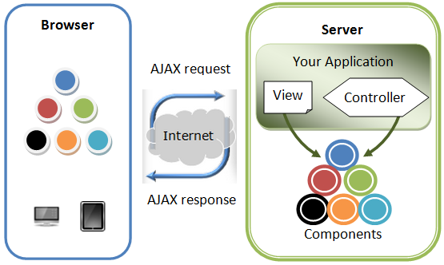
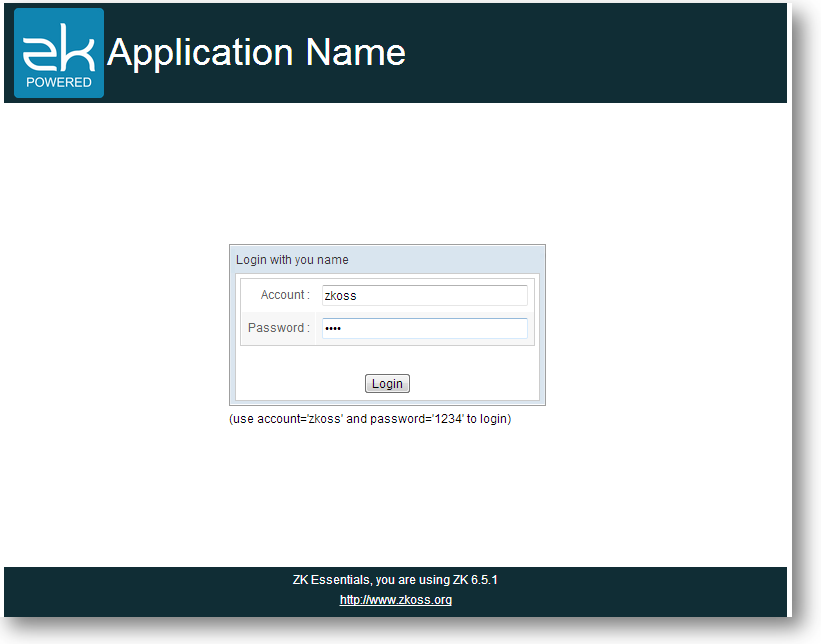
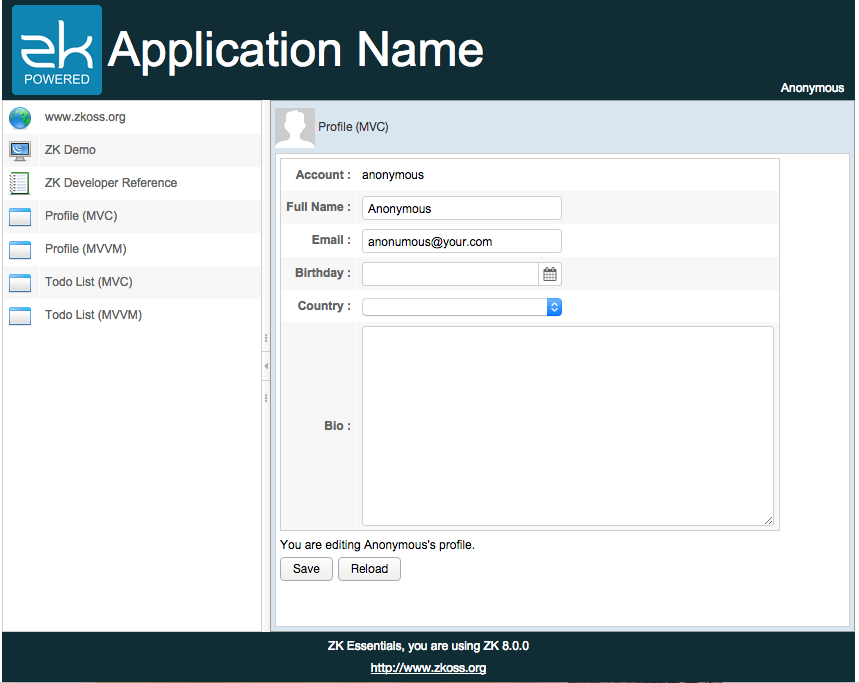
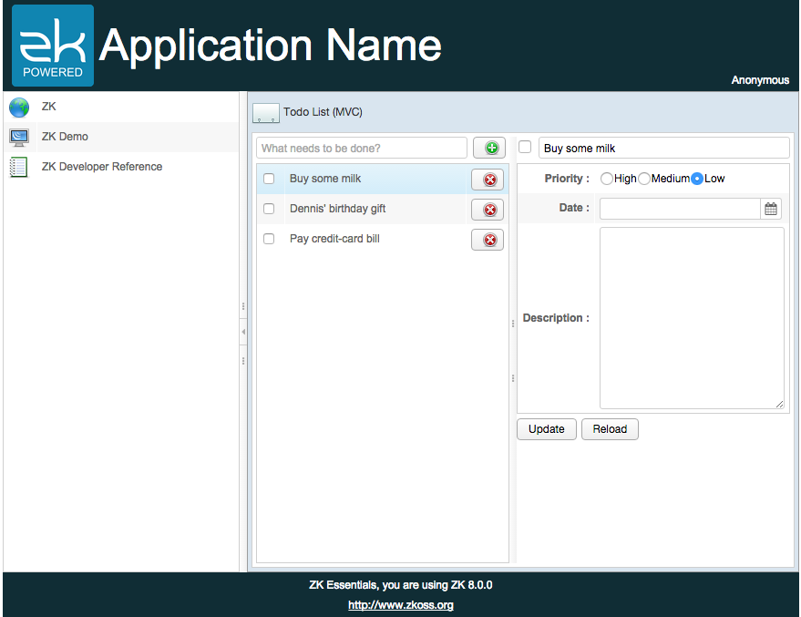

# ZK's Value and Strength

ZK is a component-based UI framework that enables you to build Rich
Internet Application (*RIA*) and mobile applications without having to
learn JavaScript or AJAX. You can build highly-interactive and
responsive AJAX web applications in pure **Java**. ZK provides hundreds
of components[^1] which are designed for various purposes, some for
displaying large amount of data and some for user input. We can easily
create components in an XML-formatted language, **ZUL**.

All user actions on a page such as clicking and typing can be easily
handled in a Controller. You can manipulate components to respond to
users action in a Controller and the changes you made will reflect to
browsers automatically. You don't need to care about communication
details between browsers and servers, ZK will handle it for you. In
addition to manipulating components directly i.e. MVC
(Model-View-Controller) pattern [^2], ZK also supports another design
pattern, MVVM (Model-View-ViewModel) [^3] which gives the Controller and
View more separation. These two approaches are mutually interchangeable,
and you can choose one of them upon your architectural consideration.

# Architecture of ZK

 

Above image is a simplified ZK architecture. When a browser visits a
page of a ZK application, ZK creates components written in ZUL and
renders them on the browser. You can manipulate components by your
application's Controller to implement UI presentation logic. All changes
you made on components will automatically reflect on users' browser and
ZK handles underlying communication for you.

ZK application developed in a server-centric way can easily access Java EE
technology stack and integrate many great third party Java frameworks
like Spring or Hibernate. Moreover, ZK also supports client-centric
development that allows you to customize visual effect or handle user
actions at the client side.

# About This Book

This book presents key concepts and suggested usage of ZK from the
perspective of building a web application. Each chapter has a main
topic, and we give one or more example applications to demonstrate each
chapter's topic. Each chapter's applications are built upon previous
chapter's application to add more features. In the last chapter, the
example application becomes close to a real application. The source code
of the example applications can be downloaded through github, please
refer to [Project Structure](../project_structure.md).

Chapter 1, we introduce how to build a common layout which contains a
header, a footer, and a sidebar.

Chapter 2, we tell you how to control components programmatically.

Chapter 3, it describes how to collect, validate user input and
response.

Chapter 4, we demonstrate how to implement common CRUD operations with a
To-Do list application.

Chapter 5, it mentions about shadow components, a new component set introduced since ZK 8.

Chapter 6, we introduce 2 navigation ways in ZK, page-based and
AJAX-based.

Chapter 7, it demonstrates a simple implementation to authenticate
users.

Chapter 8, we describe how to integrate Spring framework into a ZK
application.

Chapter 9, we demonstrate how to use JPA in a ZK application.

# Example Application
This book will guide you to build a small and rich application
that has common features such as authentication, navigation, form input,
and personal to-do list management as a final result. It manages its infrastructure with Spring and persists data into a database with JPA.

This application has a common layout. The header above has application's
icon and its title, and the footer at the bottom contains general
information. The central area displays the current main function. You
must login before you can access other functions.

<strong>Example application - login</strong>

After login, you can see the main page. The sidebar on the left is a
navigation bar that allows you to switch between different functions.
The upper three items lead you to external sites. There are 2 main
functions, profile and todo list management, which are implemented by
both the MVC and MVVM approach.

<strong>Example application - profile form</strong>

The image below shows the Todo list management function, you can create,
delete, and update a todo item.

<strong>Example application - todo list</strong>

# References

[^1]: Browse components at [ZK Demo](http://www.zkoss.org/zkdemo/)

[^2]: [ ZK Developer's Reference MVC](http://books.zkoss.org/wiki/ZK%20Developer's%20Reference/MVC)

[^3]: [ ZK Developer's Reference MVVM](http://books.zkoss.org/zk-mvvm-book/8.0/index.html)
