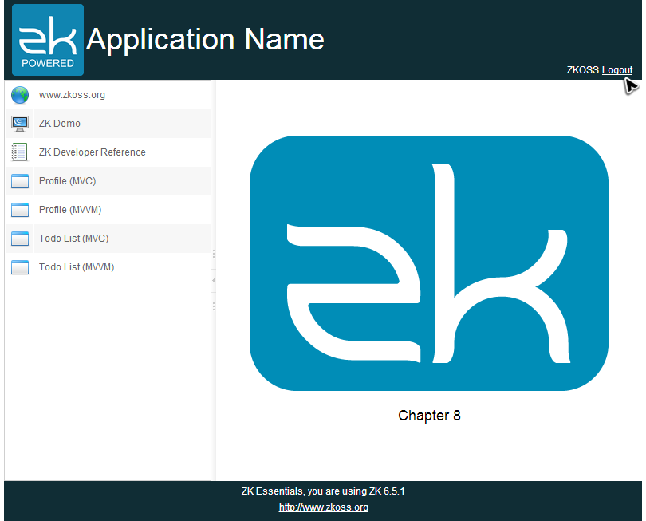

Target Application
==================

In this chapter, we will demonstrate how to implement authentication and
protect your pages from illegal access. We will create a login page
without a sidebar as follows:


After login, we redirect users to the index page and display the user
name on the right side of the header.



Authentication & Session
========================

Before proceeding to implement the authentication function, we have to
understand a "session" first. A web application operates over HTTP
protocol which is stateless; each request and its corresponding response
is handled independently. Hence, a HTTP server cannot know whether a
series of requests is sent from the same client or from different
clients. That means the server cannot maintain client's state between
multiple requests.

Application servers maintain a *session* to keep a client's state. When
the server receives the first request from a client, the server creates
a session and give the session a unique identifier. The client should
send a request with the session identifier. The server can determine
which session the request belongs to.

In a Java EE environment, an application server creates a
`javax.servlet.http.HttpSession` object to track client's session. ZK's
<javadoc>org.zkoss.zk.ui.Session</javadoc> is a wrapper of
`HttpSession`, you can use it to store user's data when you handle
events. The usage:

-   Get current session: `Sessions.getCurrent()`
-   Store data into a session: `Session.setAttribute("key", data)`
-   Retrieve data from a session: `Session.getAttribute("key")`

Almost all business applications require a security mechanism and
authentication is the fundamental part of it. Some resources are only
available to those authenticated users. Authentication is a process to
verify that a user is who he claims to be. After we authenticate a user,
the application needs to remember the user and identifies his subsequent
requests so that the application doesn't need to authenticate him
repeatedly for each further request. Hence, storing user credentials in
a session is good practice and we can tell whom the request belongs to
by the request session. Additionally, we can't tell whether a request
comes from an authenticated user by checking a user's credentials in the
request's session.

Secure Your Pages
=================

Even if you have setup an authentication mechanism, a user still can
access a page if he knows the page's URL. Therefore, we should protect a
page from illegal access by checking user's credentials in his session
when a page is requested by a user.

Authentication Service
----------------------

We can implement a service class that performs the authentication
operations.

**Get user credentials**

``` {.java}
public class AuthenticationServiceChapter5Impl implements AuthenticationService,Serializable{


    public UserCredential getUserCredential(){
        Session sess = Sessions.getCurrent();
        UserCredential cre = (UserCredential)sess.getAttribute("userCredential");
        if(cre==null){
            cre = new UserCredential();//new a anonymous user and set to session
            sess.setAttribute("userCredential",cre);
        }
        return cre;
    }
...
}
```

-   Line 5, 6: As we mentioned, we can get current session and check
    user's credentials to verify its authentication status.

**Log in/ log out**

``` {.java}
public class AuthenticationServiceChapter8Impl extends AuthenticationServiceChapter5Impl{


    UserInfoService userInfoService = new UserInfoServiceChapter5Impl();

    @Override
    public boolean login(String nm, String pd) {
        User user = userInfoService.findUser(nm);
        //a simple plan text password verification
        if(user==null || !user.getPassword().equals(pd)){
            return false;
        }

        Session sess = Sessions.getCurrent();
        UserCredential cre = new UserCredential(user.getAccount(),user.getFullName());
        ...
        sess.setAttribute("userCredential",cre);


        return true;
    }

    @Override
    public void logout() {
        Session sess = Sessions.getCurrent();
        sess.removeAttribute("userCredential");
    }
    ...
}
```

-   Line 14: Get the current session.
-   Line 17: Store user credentials into the session with a key
    `userCredential` which is used to retrieve credential back in the
    future.
-   Line 26: Remove the stored user credentials in the session.

Page Initialization
-------------------

ZK allows you to [ initialize a zul
page](ZK Developer%27s Reference/UI Patterns/Page Initialization "wikilink")
by implementing an <javadoc>org.zkoss.zk.ui.util.Initiator</javadoc>.
When we apply an initiator to a zul, ZK will use it to perform
initialization before creating components.

We can create an initiator to check existence of a user's credentials in
the session. If a user's credentials is absent, we determine it's an
illegal request and redirect it back to login page.

**Page initiator to check a user's credentials**

``` {.java}
public class AuthenticationInit implements Initiator {

    //services
    AuthenticationService authService = new AuthenticationServiceChapter8Impl();

    public void doInit(Page page, Map<String, Object> args) throws Exception {

        UserCredential cre = authService.getUserCredential();
        if(cre==null || cre.isAnonymous()){
            Executions.sendRedirect("/chapter8/login.zul");
            return;
        }
    }
}
```

-   Line 1, 6: A page initiator class should implement
    <javadoc>org.zkoss.zk.ui.util.Initiator</javadoc> and override
    `doInit()`.
-   Line 8: Get a user's credentials from current session.
-   Line 10: Redirect users back to login page.

Then we can apply this page initiator to those pages we want to protect
from unauthenticated access.

**chapter8/index.zul**

``` {.xml}
<?link rel="stylesheet" type="text/css" href="/style.css"?>
<!-- protect page by the authentication init  -->
<?init class="org.zkoss.essentials.chapter8.AuthenticationInit"?>
<!-- authentication init have to locate before composition -->
<?init class="org.zkoss.zk.ui.util.Composition" arg0="/chapter8/layout/template.zul"?>

<zk>
    <include id="mainInclude" self="@define(content)" src="/chapter8/home.zul"/>
</zk>
```

-   Line 3: Because index.zul is the main page, we apply this page
    initiator on it.

After above steps are complete, if you directly visit
<http://localhost:8080/essentials/chapter8/index.zul> without successful
authentication, you still see the login page.

The "if" Attribute
------------------

We can use an EL expression in the [ `if`
attribute](ZUML_Reference/ZUML/Attributes/if "wikilink") to determine a
component's creation according to a user's credentials in the session.
If the evaluation result of the EL expression is true, the component
will show otherwise the component will not be created.

**chapter8/layout/template.zul**

``` {.xml}

<zk>
    <!-- create only when the currentUser is not an anonymous  -->
    <borderlayout hflex="1" vflex="1"
        if="${not sessionScope.userCredential.anonymous}">
        ...
    </borderlayout>
    <div if="${sessionScope.userCredential.anonymous}">
        Redirect to login page.....
    </div>
</zk>
```

-   Line 3,4,7: [
    sessionScope](ZUML_Reference/EL_Expressions/Implicit_Objects/sessionScope "wikilink")
    is an implicit variable that allows you to access session's
    attributes. The *Borderlayout* is only created when userCredential
    is not anonymous, otherwise it shows the *Div* for redirect.

Login
=====

It is a common way to request an account and a password for
authentication. We create a login page to collect user's account and
password and the login page also uses a template zul to keep a
consistent style with the index page. However, it has no sidebar because
users, without logging in, should not be able to access main functions.

**chapter8/layout/template-anonymous.zul**

``` {.xml}
<zk>
    <!-- free to access template, without sidebar  -->
    <borderlayout hflex="1" vflex="1">
        <north height="100px" border="none" >
            <include src="/chapter8/layout/banner.zul"/>
        </north>
        <center id="mainContent" autoscroll="true"
                border="none" self="@insert(content)">
            <!-- the main content will be insert to here -->
        </center>
        <south height="50px" border="none">
            <include src="/chapter3/footer.zul"/>
        </south>
    </borderlayout>
</zk>
```

-   Line 3: As this page is made for anonymous users, we don't have to
    protect this page with `if` attribute.
-   Line 7, 8: Define an anchor named `content`.

The login form is built with *Grid*. This page should be accessible for
all users, so we don't have to apply `AuthenticationInit`.

**chapter/8/login.zul**

``` {.xml}
<?link rel="stylesheet" type="text/css" href="/style.css"?>
<!-- it is a login page, no authentication protection and use anonymous template -->
<?init class="org.zkoss.zk.ui.util.Composition"
    arg0="/chapter8/layout/template-anonymous.zul"?>
<zk>
    <hbox self="@define(content)" vflex="1" hflex="1" align="center"
        pack="center" spacing="20px">
        <vlayout>
            <window id="loginWin"
                apply="org.zkoss.essentials.chapter8.LoginController"
                title="Login with you name" border="normal" hflex="min">
                <vbox hflex="min" align="center">
                    <grid hflex="min">
                        <columns>
                            <column hflex="min" align="right" />
                            <column />
                        </columns>
                        <rows>
                            <row>
                                Account :
                                <textbox id="account" width="200px" />
                            </row>
                            <row>
                                Password :
                                <textbox id="password" type="password"
                                    width="200px" />
                            </row>
                        </rows>
                    </grid>
                    <label id="message" sclass="warn" value="&#160;" />
                    <button id="login" label="Login" />

                </vbox>
            </window>
            (use account='zkoss' and password='1234' to login)
        </vlayout>
    </hbox>
</zk>
```

-   Line 3, 4: Apply a template zul with `&lt;?init ?&gt;`.
-   Line 6: Define a fragment to be inserted in the anchor `content`.
-   Line 25: Specify "password" at `type`, then user input will be
    masked.

This login controller collects the account and password and validates
them with an authentication service class. If the password is correct,
the authentication service class saves user's credentials into the
session.

**Controller used in chapter8/login.zul**

``` {.java}

public class LoginController extends SelectorComposer<Component> {

    //wire components
    @Wire
    Textbox account;
    @Wire
    Textbox password;
    @Wire
    Label message;

    //services
    AuthenticationService authService = new AuthenticationServiceChapter8Impl();


    @Listen("onClick=#login; onOK=#loginWin")
    public void doLogin(){
        String nm = account.getValue();
        String pd = password.getValue();

        if(!authService.login(nm,pd)){
            message.setValue("account or password are not correct.");
            return;
        }
        UserCredential cre= authService.getUserCredential();
        message.setValue("Welcome, "+cre.getName());
        message.setSclass("");

        Executions.sendRedirect("/chapter8/");

    }
}
```

-   Line 20: Authenticate a user with account and password and save
    user's credential into the session if it passes.
-   Line 28: Redirect to index page after successfully authenticated.

After login, we want to display a user's account in the banner. We can
use EL to get a user's account from `UserCredential` in the session.

**chapter8/layout/banner.zul**

``` {.xml}

<div hflex="1" vflex="1" sclass="banner">
    <hbox hflex="1" vflex="1" align="center">
        <!-- other components -->

        <hbox apply="org.zkoss.essentials.chapter8.LogoutController"
            hflex="1" vflex="1" pack="end" align="end" >
            <label value="${sessionScope.userCredential.name}"
                if="${not sessionScope.userCredential.anonymous}"/>
            <label id="logout" value="Logout"
            if="${not sessionScope.userCredential.anonymous}" sclass="logout"/>
        </hbox>
    </hbox>
</div>
```

-   Line 7: The [
    sessionScope](ZUML_Reference/EL_Expressions/Implicit_Objects/sessionScope "wikilink")
    is an implicit object that you can use within EL to access session's
    attribute. It works as the same as `getAttribute()`. You can use it
    to get session's attribute with dot notation, e.g.
    `${sessionScope.userCredential}` equals to calling
    `getAttribute("userCredential")` of a `Session` object.

Logout
======

When a user logs out, we usually clear his credentials from the session
and redirect him to the login page. In our example, clicking "Logout"
label in the banner can log you out.

**chpater8/layout/banner.zul**

``` {.xml}
<div hflex="1" vflex="1" sclass="banner" >
    <hbox hflex="1" vflex="1" align="center">
        <!-- other components -->

        <hbox apply="org.zkoss.essentials.chapter8.LogoutController"
            hflex="1" vflex="1" pack="end" align="end" >
            <label value="${sessionScope.userCredential.name}"
                if="${not sessionScope.userCredential.anonymous}"/>
            <label id="logout" value="Logout"
            if="${not sessionScope.userCredential.anonymous}" sclass="logout"/>
        </hbox>
    </hbox>
</div>
```

-   Line 9, 10: We listen `onClick` event on logout label to perform
    logout action.

**LogoutController.java**

``` {.java}

public class LogoutController extends SelectorComposer<Component> {

    //services
    AuthenticationService authService = new AuthenticationServiceChapter8Impl();

    @Listen("onClick=#logout")
    public void doLogout(){
        authService.logout();
        Executions.sendRedirect("/chapter8/");
    }
}
```

-   Line 8: Call service class to perform logout.
-   Line 9: Redirect users to login page.

After completing the above steps, you can visit
<http://localhost:8080/essentials/chapter8> to see the result.

Source Code
===========

-   [ZUL
    pages](https://github.com/zkoss/zkessentials/tree/master/src/main/webapp/chapter8)
-   [Java](https://github.com/zkoss/zkessentials/tree/master/src/main/java/org/zkoss/essentials/chapter8)

