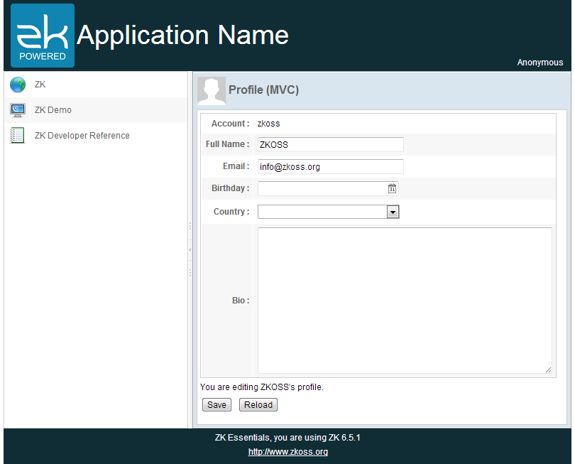

# Target Application

This chapter we will demonstrate a common scenario: collecting user
input in form style page. The target application looks as follows:

It is a personal profile form with 5 different fields. Clicking the
"Save" button saves the user's data and clicking the "Reload" button
loads previous saved data back into the form.

Starting from this chapter, we will show how to implement an example
application using both the MVC and MVVM approaches. If you are not
familiar with these two approaches, we suggest that you read [ Get ZK Up
and Running with
MVC](http://books.zkoss.org/wiki/ZK_Getting_Started/Get_ZK_Up_and_Running_with_MVC) and [
Get ZK Up and Running with
MVVM](http://books.zkoss.org/wiki/ZK Getting Started/Get ZK Up_and_Running_with_MVVM "wikilink").
These two approaches are mutually interchangeable. You can choose one of
them depending on your situation. Please refer to [ Approach
Comparison](http://books.zkoss.org/wiki/ZK_Getting_Started/Get_ZK_Up_and_Running_with_MVVM#Approach_Comparison "wikilink").

