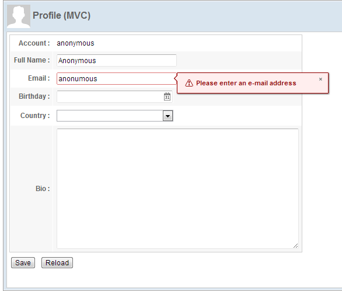

# User Input Validation

Each ZK input component provides a built-in input validation by `constraint` attribute. You can specify [a pre-defined constraint rule](http://books.zkoss.org/wiki/ZK Component Reference/Base Components/InputElement#Validation)
to activate it, then the validation works without writing any code in a controller. For example:

```xml
    <textbox id="fullName" constraint="no empty: Please enter your full name"
             width="200px"/>
```

-   The constraint rule means "no empty value allowed" for the
    `<textbox>`. If the user input violates this rule, ZK will show the
    message after a colon.


```xml
    <textbox id="email"
             constraint="/.+@.+\.[a-z]+/: Please enter an e-mail address"
             width="200px"/>
```

-   We can also define a constraint rule using a regular expression that
    describes the email format to limit the value in correct format.


```xml
<datebox id="birthday" constraint="no future" width="200px"/>
```

-   The constraint rule means "date in the future is not allowed" and it
    also restricts the available date to choose.

Then, the input component will show the specified error message when an
input value violates a specified constraint rule.


