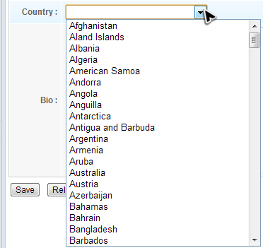
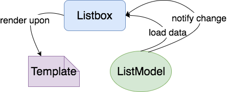
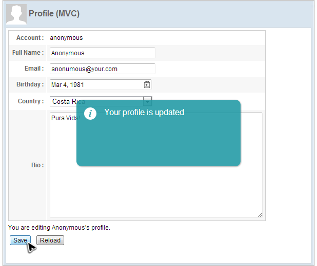

# MVC Approach
Under this approach, we implement the event handling and presentation
logic in a controller with no code present in the ZUL file. This
approach makes the responsibility of each role (Model, View, and
Controller) more cohesive and allows you to control components directly.
It is very intuitive and very flexible.


# Construct a Form Style Page
With the concept and technique we talked about in last chapter, it
should be easy to construct a form style user interface as follows. We
uses a two-column `<grid>` to build the form style layout and different
input components to receive user's profile like name and birthday. The
zul file below is included in the `<center>` of `<borderlayout>`.

We build the frame of this form first:

**chapter3/profile-mvc.zul**
```xml
<?link rel="stylesheet" type="text/css" href="/style.css"?>
<window apply="org.zkoss.essentials.chapter3.mvc.ProfileViewController"
    border="normal" hflex="1" vflex="1" contentStyle="overflow:auto">
    <caption src="/imgs/profile.png" sclass="fn-caption"
        label="Profile (MVC)"/>
    <vlayout>
        <grid width="500px">
            ...
        </grid>
        <div>You are editing <label id="nameLabel"/>'s profile.</div>
        <hlayout>
            <button id="saveProfile" label="Save"/>
            <button id="reloadProfile" label="Reload"/>
        </hlayout>
    </vlayout>
</window>
```

-   Line 4, 5:
    [`<caption>`](http://books.zkoss.org/wiki/ZK%20Component%20Reference/Containers/Caption)
    can be used to build compound header with an image for a [
    `<window>`](http://books.zkoss.org/wiki/ZK%20Component%20Reference/Containers/Window ).
-   Line 6: [
    `<vlayout>`](http://books.zkoss.org/wiki/ZK%20Component%20Reference/Layouts/Vlayout) is
    a light-weight layout component which arranges its child components
    vertically without splitter, align, and pack support.
-   Line 11:
[`<hlayout>`](http://books.zkoss.org/wiki/ZK%20Component%20Reference/Layouts/Hlayout), like `<vlayout>`, but arranges its child components horizontally.

Then let's put components in a Grid to arrange them as a form style. A `<grid>` is basically composed by `<columns>` and `<rows>`:

```xml
<grid>
    <columns>

    </columns>
    <rows>

    </rows>
</grid>    
```
* `<columns`> can have `<column>` (no 's'), and `<rows>` can have `<row>` (no 's').


**chapter3/profile-mvc.zul**
```xml
        <grid width="500px">
            <columns>
                <column align="right" hflex="min"/>
                <column/>
            </columns>
            <rows>
                <row>
                    <cell sclass="row-title">Account :</cell>
                    <cell><label id="account"/></cell>
                </row>
                <row>
                    <cell sclass="row-title">Full Name :</cell>
                    <cell>
                    <textbox id="fullName" width="200px"/>
                    </cell>
                </row>
                <row>
                    <cell sclass="row-title">Email :</cell>
                    <cell>
                    <textbox id="email" width="200px"/>
                    </cell>
                </row>
                <row>
                    <cell sclass="row-title">Birthday :</cell>
                    <cell>
                        <datebox id="birthday" width="200px"/>
                    </cell>
                </row>
                <row>
                    <cell sclass="row-title">Country :</cell>
                    <cell>
                        ...
                    </cell>
                </row>
                <row>
                    <cell sclass="row-title">Bio :</cell>
                    <cell><textbox id="bio" multiline="true"
                        hflex="1" height="200px" />
                    </cell>
                </row>
            </rows>
        </grid>
```
- Line 3: [`hflex="min"`](https://www.zkoss.org/wiki/ZK_Developer%27s_Reference/UI_Patterns/Hflex_and_Vflex#Minimum_Flexibility) can limit the column's width just wider enough to hold each row's content without a line break.
-   Line 8:
[`<cell>`](http://books.zkoss.org/wiki/ZK_Component_Reference/Supplementary/Cell) is
    used inside `<row>`, `<hbox>`, or `<vbox>` to fully control a column's align, row/column span, and width in an individual row.





# Initialize Country Drop-down List
We want to create a drop-down list that contains a list of countries in the form. When a user visits the page, the data in drop-down list should
be ready. To achieve this, we have to initialize a drop-down list in the
controller.




By setting `<listbox>` in "select" mold, We will have a drop-down list instead of a table-like component on the page.

```xml
<listbox id="country" mold="select" width="200px">
```
A component could have multiple different visual appearances. Each appearance is called a "mold". Therefore, you can choose a proper mold according to your visual requirement/page design.


## Relationship among a Component, Model, and Template
In ZK, all data components are designed to accept a separate model object that contains data to be rendered, and the component renders the data model upon a template (what you specify inside `<template>`).



This design keeps each part in its single responsibility, so that increases their reusability and decouples the data from a component's implementation.

## Use ZK `ListModel`
To create a model object, we suggest using ZK `org.zkoss.zul.ListModel` implementation e.g. `org.zkoss.zul.ListModelList` instead of Java standard collection object like `java.util.List`. Because it optimizes the rendering performance. When you call `add()` or `remove()`, `ListModel` will notify `Listbox` the data change range, so that `Listbox` can render the differential data instead of rendering the whole list.

If you use Java collection object, then ZK component has no way to know the differential part, so only can render the whole list for each time.


## Create a Data Model
Just a `<listbox>` in a zul doesn't provide any country to select. We need create a data model object.


``` java
public class ProfileViewController extends SelectorComposer<Component>{
    ...
    @Wire
    Listbox country;

    @Override
    public void doAfterCompose(Component comp) throws Exception{
        super.doAfterCompose(comp);

        ListModelList<String> countryModel = new ListModelList<String>(CommonInfoService.getCountryList());
        country.setModel(countryModel);

        ...
    }

    ...

}
```

-   Line 10: Create a `ListModelList` object with a list of `String`
-   Line 11: Provide prepared data model object to the component by
    `setModel()`.

## Define Listbox Template
The last part is to define a template, so that `<listbox>` can know how to render its data model. If you don't define it, `<listbox>` renders the model with a default built-in template.


```xml
<listbox id="country" mold="select" width="200px">
    <template name="model">
        <listitem label="${each}" />
    </template>
</listbox>
```
- Line 2: The `name` attribute has to be **model** which means it's  [a template for `<listbox>` model](https://www.zkoss.org/wiki/ZK%20Developer's%20Reference/MVC/View/Template/Listbox%20Template).
-   Line 3: The `${each}` is an implicit variable that you can use
    without declaration inside `<template>`, and it represents one object of the data model for each iteration when rendering. We use
    this variable with dot notation at component attributes to reference a data object's property . In our example, we just set it at `<listitem>`'s label.

# Initialize Input Components
When a user visits this page, we want profile data to be loaded in
the form and ready to be modified. Hence, we should initialize those
input components in a controller by loading previously-saved data to input components.

To manipulate components, we need to get their object reference by [`@Wire`](https://www.zkoss.org/wiki/ZK_Developer%27s_Reference/MVC/Controller/Wire_Components).

```java
public class ProfileViewController extends SelectorComposer<Component>{

    //wire components
    @Wire
    Label account;
    @Wire
    Textbox fullName;
    @Wire
    Textbox email;
    @Wire
    Datebox birthday;
    @Wire
    Listbox country;
    @Wire
    Textbox bio;

    //services
    AuthenticationService authService = new AuthenticationServiceChapter3Impl();
    UserInfoService userInfoService = new UserInfoServiceChapter3Impl();
    ...
```
-  Line 19: A controller usually calls service classes to perform business operations or get necessary data.


To make sure all components objects are wired, we initialize them in `doAfterCompose()`.
``` java

public class ProfileViewController extends SelectorComposer<Component>{

    ...

    @Override
    public void doAfterCompose(Component comp) throws Exception{
        super.doAfterCompose(comp);

        ListModelList<String> countryModel = new ListModelList<String>(CommonInfoService.getCountryList());
        country.setModel(countryModel);

        refreshProfileView();
    }

    ...

    private void refreshProfileView() {
        UserCredential userCredential = authService.getUserCredential();
        User user = userInfoService.findUser(userCredential.getAccount());
        if(user==null){
            //TODO handle un-authenticated access
            return;
        }

        //apply bean value to UI components
        account.setValue(user.getAccount());
        fullName.setValue(user.getFullName());
        email.setValue(user.getEmail());
        birthday.setValue(user.getBirthday());
        bio.setValue(user.getBio());

        ((ListModelList)country.getModel()).addToSelection(user.getCountry());
        ...
    }
}
```
-   Line 13: Load previously-saved data to input components to initialize UI, so we should call it after initializing country list.
-   Line 27-31: Push saved user data to components by `setValue()`.
-   Line 33: Use `ListModelList.addToSelection()` to set the
    `Listbox`'s selected item.


# Save & Reload Data

The example application has 2 functions, save and reload, which are both
triggered by clicking a button. If you click the "Save" button, the
application will save your input and show a notification box.

<div style="text-align:center">

</div>
<div style="text-align:center">
<strong>Click "Save" button</strong>
</div>

In this section, we will demonstrate a more flexible way to define an
event listener in a controller with [`@Listen`](https://www.zkoss.org/wiki/ZK_Developer%27s_Reference/MVC/Controller/Wire_Event_Listeners) other than
calling `addEventListener()`.

An event listener method should be public, have a void return type, and
have either no parameter or one parameter of the specific event type
(corresponding to the event listened) with `@Listen` in a controller.
You should specify event listening rule in the annotation's element
value. Then ZK will "wire" the method to the specified components for
specified events. ZK provides [various wiring selectors](http://books.zkoss.org/wiki/ZK Developer%27s Reference/MVC/Controller/Wire Event Listeners) to specify in the
annotation.

## Listen "Save" button's clicking

``` java
public class ProfileViewController extends SelectorComposer<Component>{

    @Listen("onClick=#saveProfile")
    public void doSaveProfile(){
        ...
    }
    ...
}
```

-   Line 3: The `@Listen` will make `doSaveProfile()` be invoked when a
    user clicks a component (`onClick`) whose id is "saveProfile"
    (`#saveProfile`).


We can manipulate components to change the UI in the event
listener. In `doSaveProfile()`, we get a user's input from input
components and save the data to a `User` object. Then show a
notification to the client.

## Handle "Save" button's clicking

``` java
public class ProfileViewController extends SelectorComposer<Component>{
....

    @Listen("onClick=#saveProfile")
    public void doSaveProfile(){
        UserCredential userCredential = authService.getUserCredential();
        User user = userInfoService.findUser(userCredential.getAccount());
        if(user==null){
            //TODO handle un-authenticated access
            return;
        }

        //apply component value to bean
        user.setFullName(fullName.getValue());
        user.setEmail(email.getValue());
        user.setBirthday(birthday.getValue());
        user.setBio(bio.getValue());

        Set<String> selection = ((ListModelList)country.getModel()).getSelection();
        if(!selection.isEmpty()){
            user.setCountry(selection.iterator().next());
        }else{
            user.setCountry(null);
        }

        userInfoService.updateUser(user);

        Clients.showNotification("Your profile is updated");
    }
    ...
}
```

-   Line 7: In this chapter's example, `UserCredential` is initialized
    with "Anonymous". We will put a user data in chapter 8.
-   Line 14: Get users input by calling `getValue()`.
-   Line 19: Get a user's selection for a `Listbox` from its model
    object.
-   Line 28: Show a notification box which is the most easy way to show
    a message to users.


## Handle "Reload" Button's Clicking
To wire the event listener for "Reload" button's is similar as the previous
one, but we use a different selector this time. And the method pushes saved user data to components using `setValue()`, so we can just call previously-implemented `refreshProfileView()`.

``` java
public class ProfileViewController extends SelectorComposer<Component>{

    ...
    @Listen("onClick = button[label = 'Reload']")
    public void doReloadProfile(){
        refreshProfileView();
    }

    ...
}
```

-   Line 6: This method is listed in the previous section.

After the above steps, we have finished all functions of the target
application. Quite simple, right? Please run /chapter3/index.zul to see the result.
