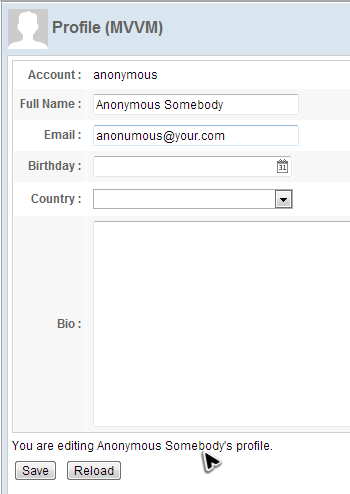
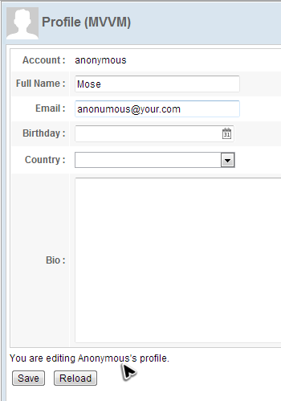

# MVVM Approach

In addition to the MVC approach, ZK also allows you to design your
application in another architecture: [ *MVVM
(Model-View-ViewModel)*](http://books.zkoss.org/zk-mvvm-book/8.0/index.html).
This architecture also divides an application into 3 roles: **View**, **Model**,
and **ViewModel**. The View and Model plays the same roles as they do in
MVC. The ViewModel in MVVM acts like a special Controller for the View
which is responsible for exposing data from the Model to the View and
for providing required action and logic for user requests from the View.
The ViewModel is a View abstraction, which contains a View's state and
behavior. The biggest difference from the Controller in the MVC is that
**ViewModel should not contain any reference to UI components** and knows nothing about the View's visual elements. Hence this clear separation between View and ViewModel decouples ViewModel from View and makes ViewModel more reusable and more abstract.

Since the ViewModel contains no reference to UI components, you cannot
control components directly e.g. to get value from them or set value to
them. Therefore we need a mechanism to synchronize data between the View
and ViewModel. Additionally, this mechanism also has to bridge events
from the View to the action provided by the ViewModel. This mechanism,
the kernel operator of the MVVM design pattern, is a data binding system
called "ZK Bind" provided by the ZK framework. In this binding system,
the [
**binder**](http://books.zkoss.org/wiki/ZK Developer's Reference/MVVM/DataBinding/Binder)
plays the key role to operate the whole mechanism. The binder is like a
broker and responsible for communication between View and ViewModel.


This section we will demonstrate how to implement the same target
application under MVVM approach.


# Construct a View

Building a user interface using the MVVM approach is not different from
the MVC approach.

**Extracted from chapter3/profile-mvvm-property.zul**
``` xml
<?link rel="stylesheet" type="text/css" href="/style.css"?>
<window border="normal" hflex="1" vflex="1" contentStyle="overflow:auto">
    <caption src="/imgs/profile.png" sclass="fn-caption"
             label="Profile (MVVM)"/>
    <vlayout>
        <grid width="500px" >
            <columns>
                <column align="right" hflex="min"/>
                <column/>
            </columns>
            <rows>
                <row>
                    <cell sclass="row-title">Account :</cell>
                    <cell><label/></cell>
                </row>
                <row>
                    <cell sclass="row-title">Full Name :</cell>
                    <cell>
                    <textbox
                    constraint="no empty: Plean enter your full name"
                             width="200px"/>
                    </cell>
                </row>
                <row>
                    <cell sclass="row-title">Email :</cell>
                    <cell>
                    <textbox
                    constraint="/.+@.+\.[a-z]+/: Please enter an e-mail address"
                    width="200px"/>
                    </cell>
                </row>
                <row>
                    <cell sclass="row-title">Birthday :</cell>
                    <cell><datebox constraint="no future" width="200px"/>
                    </cell>
                </row>
                <row>
                    <cell sclass="row-title">Country :</cell>
                    <cell>
                        <listbox  mold="select" width="200px">
                            <template name="model">
                                <listitem />
                            </template>
                        </listbox>
                    </cell>
                </row>
                <row>
                    <cell sclass="row-title">Bio :</cell>
                    <cell>
                    <textbox
                    multiline="true" hflex="1" height="200px" />
                    </cell>
                </row>
            </rows>
        </grid>
        <div>You are editing <label />'s profile.</div>
        <hlayout>
            <button  label="Save"/>
            <button  label="Reload"/>
        </hlayout>
    </vlayout>
</window>
```

-   Line 41: You might notice that there is no EL expression `${each}`
    as we will use data binding to access it.




## Create a ViewModel
ViewModel is an abstraction of View which contains the View's data,
state and behavior. It extracts the necessary data to be displayed on
the View from one or more Model classes. Those data are exposed through
getter and setter method like JavaBean's property. ViewModel is also a
"Model of the View". It contains the View's state (e.g. user's
selection, whether a component is enabled or disabled) that might change
during user interaction.

In ZK, the ViewModel can simply be a POJO which contains data to display
on the ZUL and doesn't have any components. The example application
displays 2 kinds of data: the user's profile and country list in the
*Listbox*. The ViewModel should look like the following:

**Define properties in a ViewModel**

``` java

public class ProfileViewModel implements Serializable{

    //services
    AuthenticationService authService = new AuthenticationServiceChapter3Impl();
    UserInfoService userInfoService = new UserInfoServiceChapter3Impl();

    //data for the view
    User currentUser;

    public User getCurrentUser(){
        return currentUser;
    }

    public List<String> getCountryList(){
        return CommonInfoService.getCountryList();
    }

    @Init // @Init annotates a initial method
    public void init(){
        UserCredential cre = authService.getUserCredential();
        currentUser = userInfoService.findUser(cre.getAccount());
        if(currentUser==null){
            //TODO handle un-authenticated access
            return;
        }
    }
    ...
}
```

-   Line 4,5: The ViewModel usually contains service classes that are
    used to get data from them or perform business logic.
-   Line 8, 10: We should define current user profile data and its
    getter method to be displayed in the zul.
-   Line 14: ViewModel exposes its data by getter methods, it doesn't
    have to define a corresponding member variable. Hence we can expose
    country list by getting from the service class.
-   Line 18: There is a marker annotation `@Init` for a method which
    should be at most one in each ViewModel and ZK will invoke this
    method after instantiating a ViewModel class. We should perform
    initialization in it, e.g. get user credential to initialize
    `currentUser`.

### Define Commands

ViewModel also contains View's behaviors which are implemented by
methods. We call such a method "Command" of the ViewModel. These methods
usually manipulate data in the ViewModel, for example deleting an item.
The View's behaviors are usually triggered by events from the View. The
Data binding mechanism also supports binding an event to a ViewModel's
command. Firing the component's event will trigger the execution of
bound command that means invoking the corresponding command method.

For ZK to recognize a command method in a ViewModel, you should apply
annotation `@Command` to a command method. You could specify a command
name which is the method's name by default if no specified. Our example
has two behavior: "save" and "reload", so we define two command methods
for each of them:

**Define commands in a ViewModel**

``` java

public class ProfileViewModel implements Serializable{
    ...

    @Command //@Command annotates a command method
    public void save(){
        currentUser = userInfoService.updateUser(currentUser);
        Clients.showNotification("Your profile is updated");
    }

    @Command
    public void reload(){
        UserCredential cre = authService.getUserCredential();
        currentUser = userInfoService.findUser(cre.getAccount());
    }
}
```

-   Line 4, 10: Annotate a method with `@Command` to make it become a
    command method, and it can be bound with data binding in a zul.
-   Line 5: Method name is the default command name if you don't specify
    in `@Command`. This method save the `currentUser` with a service
    class and show a notification.

During execution of a command, one or more properties may be changed due
to performing business or presentation logic. Developers have to specify
which property (or properties) is changed, then the data binding
mechanism can reload them to synchronize the View to the latest state.

The syntax to notify property change:

One property:

` @NotifyChange("oneProperty") `

Multiple properties:

` @NotifyChange({"property01","property02"}) `

All properties in a ViewModel:

` @NotifyChange("*") `

**Define notification & commands in a ViewModel**

``` java

public class ProfileViewModel implements Serializable{
    ...

    @Command //@Command annotates a command method
    @NotifyChange("currentUser") //@NotifyChange annotates data changed notification after calling this method
    public void save(){
        currentUser = userInfoService.updateUser(currentUser);
        Clients.showNotification("Your profile is updated");
    }

    @Command
    @NotifyChange("currentUser")
    public void reload(){
        UserCredential cre = authService.getUserCredential();
        currentUser = userInfoService.findUser(cre.getAccount());
    }
}
```

-   Line 5, 12: Notify which property change with `@NotifyChange` and zK
    will reload those attributes that are bound to `currentUser`.

### Apply a ViewModel on a Component

Before data binding can work, we must apply a composer called
**org.zkoss.bind.BindComposer**. It will create a **binder** for the
ViewModel and instantiate the ViewModel's class. Then we should bind a
ZK component to our ViewModel by setting its `'''viewModel'''` attribute
with the ViewModel's id in ` @id ` and the ViewModel's full-qualified
class name in ` @init `. The id is used to reference the ViewModel's
properties, e.g. `vm.name`, whilst the full-qualified class name is used
to instantiate the ViewModel object itself. So that component becomes
the *Root View Component* for the ViewModel. All child components of
this Root View Component can be bound to the same ViewModel and its
properties, so we usually bind the root component of a page to a
ViewModel.

``` xml

<window apply="org.zkoss.bind.BindComposer"
    viewModel="@id('vm') @init('org.zkoss.essentials.chapter3.mvvm.ProfileViewModel')"
    border="normal" hflex="1" vflex="1" contentStyle="overflow:auto">
...
</window>
```

-   Line 1: Under MVVM approach, the composer we apply is fixed
    **org.zkoss.bind.BindComposer**.
-   Line 2: Specify ViewModel's id with ` @id ` and the its
    full-qualified class name in ` @init ` for the binder.

## Data Binding to ViewModel's Properties

Now that ViewModel is prepared and bound to a component, we can bind a
component's attributes to the ViewModel's property. The binding between
an attribute and a ViewModel's property is called "property binding".
Once the binding is established, ZK will synchronize (load and save)
data between components and the ViewModel for us automatically.


Let's demonstrate how to make *Listbox* load a list of country name from
the ViewModel. We have talked about the data model
concept in previous MVC approach section, and we also need to prepare a model object that
are defined in one of our ViewModel's properties, `countryList`. You
might find `getCountryList()` return a `List` instead of a
`ListModelList`, but don't worry. ZK will convert it automatically. We
use `@load` to load a ViewModel's property to a component's attribute
and `@save` to save an attribute value into a ViewModel's property
(usually for an input component). If both loading and saving are
required, we could use `@bind`.

``` xml
...
    <cell>
        <listbox model="@load(vm.countryList)" mold="select" width="200px">
            <template name="model">
                <listitem label="@load(each)" />
            </template>
        </listbox>
    </cell>
...
```

-   Line 3: We setup a load binding with `@load`. The `vm` is the
    ViewModel's id we specified at `@id` in previous section and the
    target property (`countryList`) can be referenced in dot notation.
-   Line 4: *Template* component, we have explained in MVC approach
    section, can create its child components repeatedly upon the data
    model of parent component.
-   Line 5: The implicit variable `each` which you can use without
    declaration inside *Template* represents each object in the data
    model for each iterative rendering (It represents String object of a
    country name in this example). We use this variable to access
    objects of data model. In our example, we just make it as a
    *Listitem*'s label.

In MVC approach, we have to call an input component's getter method
(e.g. `getValue()` ) to collect user input. But in MVVM approach, ZK
will save user input back to a ViewModel automatically. For example in
the below zul, user input is saved automatically when you move the focus
out of the *Textbox*.

``` xml
        <textbox value="@bind(vm.currentUser.fullName)"
            constraint="no empty: Plean enter your full name" width="200px"/>
```

For the property `currentUser`, we want to both save user input back to
the ViewModel and load value from the ViewModel, so we should use the
`@bind` at `value` attribute. Notice that you can bind `selectedItem` to
a property, then the user's selection can be saved automatically to the
ViewModel.

``` xml
...
    <rows>
        <row>
            <cell sclass="row-title">Account :</cell>
            <cell>
                <label value="@load(vm.currentUser.account)"/>
            </cell>
        </row>
        <row>
            <cell sclass="row-title">Full Name :</cell>
            <cell>
                <textbox value="@bind(vm.currentUser.fullName)"
                    constraint="no empty: Plean enter your full name"
                        width="200px"/>
            </cell>
        </row>
        <row>
            <cell sclass="row-title">Email :</cell>
            <cell>
                <textbox value="@bind(vm.currentUser.email)"
                constraint="/.+@.+\.[a-z]+/: Please enter an e-mail address"
                    width="200px"/>
            </cell>
        </row>
        <row>
            <cell sclass="row-title">Birthday :</cell>
            <cell>
                <datebox value="@bind(vm.currentUser.birthday)"
                    constraint="no future" width="200px"/>
            </cell>
        </row>
        <row>
            <cell sclass="row-title">Country :</cell>
            <cell>
                <listbox model="@load(vm.countryList)"
                    selectedItem="@bind(vm.currentUser.country)"
                        mold="select" width="200px">
                    <template name="model">
                        <listitem label="@load(each)" />
                    </template>
                </listbox>
            </cell>
        </row>
        <row>
            <cell sclass="row-title">Bio :</cell>
            <cell>
                <textbox value="@bind(vm.currentUser.bio)"
                    multiline="true" hflex="1" height="200px" />
            </cell>
        </row>
    </rows>

...
```

-   Line 12, 20, 28, 47: Use `@bind` to save user input back to the
    ViewModel and load value from the ViewModel.
-   Line 36: Bind `selectedItem` to `vm.currentUser.country` and the
    selected country will be saved to `currentUser`.

## Handle User Interactions by Command Binding

After we finish binding attributes to the ViewModel's data, we still
need to handle user actions, button clicking. Under the MVVM approach,
we handle events by binding an event attribute (e.g. `onClick`) to a
**Command** of a ViewModel. After we bind an event to a Command, each
time the event is sent, ZK will invoke the corresponding command method.
Hence, we should write our business logic in a command method. After
executing the command method, some properties might be changed. We
should tell ZK which properties are changed by us, then the binder will
reload them to components.

When creating the `ProfileViewModel` in the previous section, we have
defined two commands: `save` and `reload`.

Then, we can bind `onClick` event to above commands with command binding
`@command('commandName')` as follows:

``` xml
...
        <hlayout>
            <button onClick="@command('save')" label="Save"/>
            <button onClick="@command('reload')" label="Reload"/>
        </hlayout>
...
```

Done with this binding, clicking each button will invoke corresponding
command methods to save (or reload) the user profile to the ViewModel.


## Keep Away Unsaved Input
Once you create a property binding with `@bind` for an input component,
ZK will save user input back to a ViewModel automatically. But sometimes
this automation is not what users want. In our example, most people
usually expect `currentUser` to change after their confirmation for
example, clicking a button.

There is a line of text "You are editing an Anonymous's profile" at the
bottom of the form. If you change the full name to "Anonymous Somebody"
and move to next field, the line of text is changed even you don't press
the "Save" button. This could be a problem maybe it would mislead users,
making them think they have changed their profile, so we don't want
this.



<div style="text-align:center">
<strong>Unsaved Input Changes Data</strong>

</div>
We are going to improve this part with **form binding** feature in this
section.

Form binding automatically creates a middle object as a buffer. Before
saving to ViewModel all input data is saved to the middle object. In
this way we can keep dirty data from saving into the ViewModel before
the user confirms.

Steps to use a form binding:

1.  Give an id to middle object in `'''form'''` attribute with ` @id `.

    Then you can reference the middle object in ZK bind expression with its id, e.g. `@id('fx')`.

2.  Specify ViewModel's property to be loaded with ` @load `
3.  Specify ViewModel's property to save and before which Command with
    ` @save `

    This means binder will save the middle object's properties to ViewModel before a command execution.

4.  Bind component's attribute to the middle object's properties like
    you do in property binding.

    You should use middle object's id specified in ` @id ` to reference its property, e.g. `@load(fx.account)`.

**extracted from chapter3/profile-mvvm.zul**

``` xml
...
    <grid width="500px"
    form="@id('fx')@load(vm.currentUser)@save(vm.currentUser, before='save')">
        ...
        <rows>
            <row>
                <cell sclass="row-title">Account :</cell>
                <cell><label value="@load(fx.account)"/></cell>
            </row>
            <row>
                <cell sclass="row-title">Full Name :</cell>
                <cell>
                    <textbox value="@bind(fx.fullName)" width="200px"
                    constraint="no empty: Plean enter your full name"/>
                </cell>
            </row>
            <row>
                <cell sclass="row-title">Email :</cell>
                <cell>
                    <textbox value="@bind(fx.email)" width="200px"
                constraint="/.+@.+\.[a-z]+/: Please enter an e-mail address"/>
                </cell>
            </row>
            <row>
                <cell sclass="row-title">Birthday :</cell>
                <cell>
                    <datebox value="@bind(fx.birthday)" width="200px"
                    constraint="no future" />
                </cell>
            </row>
            <row>
                <cell sclass="row-title">Country :</cell>
                <cell>
                    <listbox model="@load(vm.countryList)"
                        mold="select" width="200px"
                        selectedItem="@bind(fx.country)">
                        <template name="model">
                            <listitem label="@load(each)"/>
                        </template>
                    </listbox>
                </cell>
            </row>
            <row>
                <cell sclass="row-title">Bio :</cell>
                <cell><textbox value="@bind(fx.bio)" multiline="true"
                    hflex="1" height="200px" />
                </cell>
            </row>
        </rows>
    </grid>
    <div>You are editing
        <label value="@load(vm.currentUser.fullName)"/>'s profile.
    </div>
...
```

-   Line 2, 3: Define a form binding at `form` attribute and give the
    middle object's id `fx`. Specify `@load(vm.currentUser)` makes the
    binder load `currentUser`'s properties to the middle object and
    `@save(vm.currentUser, before='save')` makes the binder save middle
    object's data back to `vm.currentUser` before executing the command
    `save`.
-   Line 8, 13, 20, 27, 36, 45: We should bind attributes to middle
    object's properties to avoid altering ViewModel's properties.
-   LIne 51, 52, 53: The label bound to `vm.currentUser.fullName` is not
    affected when `fx` is changed.

After applying form binding, any user's input will not actually change
`currentUser`'s value and they are stored in the middle object until you
click the "Save" button, ZK puts the middle object's data back to the
ViewModel's properties (`currentUser`).



<div style="text-align:center">
<strong>Unsaved Input Doesn't Change Data</strong>

</div>
After completing above steps, visit
http://localhost:8080/zkessentials/chapter3/index-mvvm.zul to see the
result.
