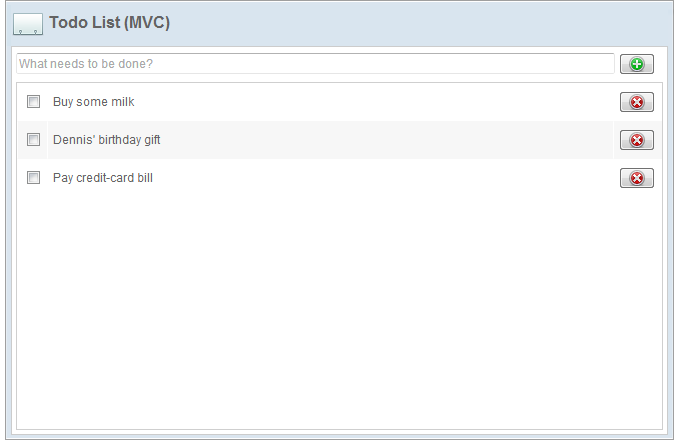
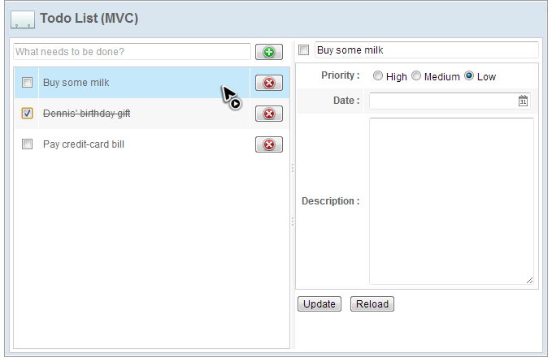

# Target Application
In this chapter, we are going to build a "todo list" with 4 basic operations, create, read, update, and delete (CRUD). The application's user interface looks like the images below:

<strong>Select a Todo Item</strong>

It is a personal todo list management system and it has following
features:

1.  List all todo items
2.  Create a todo item. 
Type item name in upper-left textbox and click  or press "Enter" key to create a new todo item.

3.  Finish a todo item. 
Click the checkbox in front of a todo item to mark it as finished and the item name will be decorated with line-through.

4.  Modify a todo item. 
Click an existing item and the detail editor appears. Then you can edit the item's details.

5.  Delete a todo item. 
Click  to delete an existing todo item.

In this chapter, we will show how to implement the target application
using both the MVC and MVVM approaches. If you are not familiar with
these two approaches, we suggest you to read [ Get ZK Up and Running
with MVC](http://books.zkoss.org/wiki/ZK Getting Started/Get ZK Up_and_Running_with_MVC )
and [ Get ZK Up and Running with
MVVM](http://books.zkoss.org/wiki/ZK Getting Started/Get ZK Up_and_Running_with_MVVM ).
These two approaches are mutually interchangeable. You can choose one of
them depending on your situation.
