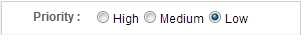

# MVC Approach

If you have read previous chapters, constructing the user interface for
the example application should not be a big problem. Let's look at the
layout first and ignore the details.

**Layout in chapter4/todolist-mvc.zul**

```xml

<?link rel="stylesheet" type="text/css" href="/style.css"?>
<window apply="org.zkoss.essentials.chapter4.mvc.TodoListController"
    border="normal" hflex="1" vflex="1" contentStyle="overflow:auto">
    <caption src="/imgs/todo.png" sclass="fn-caption" label="Todo List (MVC)"/>
    <borderlayout>
        <center autoscroll="true" border="none">
            <vlayout hflex="1" vflex="1">
                <!-- todo creation function-->
                <!-- todo list -->
            </vlayout>
        </center>
        <east id="selectedTodoBlock" visible="false"
        width="300px" border="none" collapsible="false"
        splittable="true" minsize="300" autoscroll="true">
            <vlayout >
                <!-- detail editor -->
            </vlayout>
        </east>
    </borderlayout>
</window>
```

-   Line 5: We construct the user interface with a *Border Layout* to
    separate user interface into 2 areas.
-   Line 6: The center area contains a todo creation function and a todo
    list.
-   Line 12, 13: The east area is a todo item detail editor which is
    invisible if no item selected.

## Read


As we talked in previous chapters, we can use *Template* to define how
to display a data model list with implicit variable `each`.

**Display a ToDo List**

```xml
...
    <listbox id="todoListbox" vflex="1">
        <listhead>
            <listheader width="30px" />
            <listheader/>
            <listheader hflex="min"/>
        </listhead>
        <template name="model">
            <listitem sclass="${each.complete?'complete-todo':''}"
                value="${each}">
                <listcell>
                    <checkbox forward="onCheck=todoListbox.onTodoCheck"
                        checked="${each.complete}"/>
                </listcell>
                <listcell>
                    <label value="${each.subject}"/>
                </listcell>
                <listcell>
                    <button forward="onClick=todoListbox.onTodoDelete"
                        image="/imgs/cross.png" width="36px"/>
                </listcell>
            </listitem>
        </template>
    </listbox>
...
```

-   Line 8: The default value for the required attribute `name` is
    "model".
-   Line 10: The `${each}` is an implicit variable that you can use
    without declaration inside *Template*, and it represents each object
    of the data model list. We can implement simple presentation logic
    with EL expressions. Here we apply different styles according to a
    flag `each.complete`. We also set a whole object in `value`
    attribute, and later we can get the object in the controller.
-   Line 13: The `each.complete` is a boolean variable so that we can
    assign it to `checked`. By doing this, the *Checkbox* will be
    checked if the todo item's `complete` variable is true.
-   Line 12, 19: The `forward` attribute is used to forward events to
    another component and we will talk about it in later sections.

In the controller, we should provide a data model for the *Listbox*.

```java
public class TodoListController extends SelectorComposer<Component>{


    //wire components
    ...
    @Wire
    Listbox todoListbox;

    ...

    //services
    TodoListService todoListService = new TodoListServiceChapter4Impl();

    //data for the view
    ListModelList<Todo> todoListModel;
    ListModelList<Priority> priorityListModel;
    Todo selectedTodo;


    @Override
    public void doAfterCompose(Component comp) throws Exception{
        super.doAfterCompose(comp);

        //get data from service and wrap it to list-model for the view
        List<Todo> todoList = todoListService.getTodoList();
        todoListModel = new ListModelList<Todo>(todoList);
        todoListbox.setModel(todoListModel);

        ...
    }
...
}
```

-   Line 25 \~ 27: We initialize the data model in `doAfterCompose()`.
    Get data from the service class `todoListService` and create a
    `ListModelList` object. Then set it as the data model of
    `todoListbox`.

There is a priority radiogroup in todo item detail editor appeared on
the right hand side when you select an item.



<div style="text-align:center">
<strong>Todo Item's Priority Radiogroup</strong>

</div>
In our application, its priority labels come from an enumerating
`Priority` instead of a static text. We can still use *Template* to
define how to create each *Radio* under a *Radiogroup*. The zul looks
like as follows:

```xml
...
        <row>
            <cell sclass="row-title">Priority :</cell>
            <cell>
                <radiogroup id="selectedTodoPriority">
                    <template name="model">
                        <radio label="${each.label}"/>
                    </template>
                </radiogroup>
            </cell>
        </row>
...
```

-   Line 6 \~8: Define how to create each *Radio* with *Template* and
    assign `each.label` to `label` attribute.

We also need to provide a data model for the *Radiogroup* in the
controller:

```java
public class TodoListController extends SelectorComposer<Component>{


    //wire components
    ...
    @Wire
    Listbox todoListbox;

    ...
    @Wire
    Radiogroup selectedTodoPriority;
    ...

    //services
    TodoListService todoListService = new TodoListServiceChapter4Impl();

    //data for the view
    ListModelList<Todo> todoListModel;
    ListModelList<Priority> priorityListModel;
    Todo selectedTodo;

    @Override
    public void doAfterCompose(Component comp) throws Exception{
        super.doAfterCompose(comp);

        //get data from service and wrap it to list-model for the view
        List<Todo> todoList = todoListService.getTodoList();
        todoListModel = new ListModelList<Todo>(todoList);
        todoListbox.setModel(todoListModel);

        priorityListModel = new ListModelList<Priority>(Priority.values());
        selectedTodoPriority.setModel(priorityListModel);
    }
...
}
```

-   Line 31, 32: Create a `ListModelList` with `Priority` and set it as
    a model of `selectedTodoPriority`.

## Create


After typing the todo item name, we can save the item by either clicking
the button with the plus icon
() or pressing
"Enter" key. Therefore, we have to listen to 2 events: `onClick` and
`onOK`. For handling other key pressing events, please refer to
[ZK\_Developer's\_Reference/UI\_Patterns/Keystroke\_Handling](ZK_Developer's_Reference/UI_Patterns/Keystroke_Handling "wikilink").

```java
public class TodoListController extends SelectorComposer<Component>{

    //wire components
    @Wire
    Textbox todoSubject;

    //services
    TodoListService todoListService = new TodoListServiceChapter4Impl();

    //data for the view
    ListModelList<Todo> todoListModel;
    ListModelList<Priority> priorityListModel;
    Todo selectedTodo;

    ...

    //when user clicks on the button or enters on the textbox
    @Listen("onClick = #addTodo; onOK = #todoSubject")
    public void doTodoAdd(){
        //get user input from view
        String subject = todoSubject.getValue();
        if(Strings.isBlank(subject)){
            Clients.showNotification("Nothing to do ?",todoSubject);
        }else{
            //save data
            selectedTodo = todoListService.saveTodo(new Todo(subject));
            //update the model of listbox
            todoListModel.add(selectedTodo);
            //set the new selection
            todoListModel.addToSelection(selectedTodo);

            //refresh detail view
            refreshDetailView();

            //reset value for fast typing.
            todoSubject.setValue("");
        }
    }
...
}
```

-   Line 18: Listen the button's `onClick` event and "Enter" key
    pressing event: `onOK`.
-   Line 19: This method adds a todo item, update the data model of
    *Listbox*, change the selection to a newly created one, then reset
    the input field of the *Textbox*.
-   Line 21: Get user input in the *Textbox* `todoSubject` by
    `getValue()`.
-   Line 23: Show a notification at the right hand side of the *Textbox*
    `todoSubject`.
-   Line 28: When you change (add or remove) items in a `ListModelList`
    object, it will automatically render in the *Listbox*'s.
-   Line 30: Call `addToSelection()` to assign a component's selection
    and it will automatically reflect to the corresponding widget's
    selection.

## Update


To update a todo item, you should select an item first then detail
editor will appear. The following codes demonstrate how to listen a
"onSelect" event and display the item's detail.

```java
public class TodoListController extends SelectorComposer<Component>{


    //wire components
    @Wire
    Textbox todoSubject;
    @Wire
    Button addTodo;
    @Wire
    Listbox todoListbox;

    @Wire
    Component selectedTodoBlock;
    @Wire
    Checkbox selectedTodoCheck;
    @Wire
    Textbox selectedTodoSubject;
    @Wire
    Radiogroup selectedTodoPriority;
    @Wire
    Datebox selectedTodoDate;
    @Wire
    Textbox selectedTodoDescription;
    @Wire
    Button updateSelectedTodo;


    //when user selects a todo of the listbox
    @Listen("onSelect = #todoListbox")
    public void doTodoSelect() {
        if(todoListModel.isSelectionEmpty()){
            //just in case for the no selection
            selectedTodo = null;
        }else{
            selectedTodo = todoListModel.getSelection().iterator().next();
        }
        refreshDetailView();
    }

    private void refreshDetailView() {
        //refresh the detail view of selected todo
        if(selectedTodo==null){
            //clean
            selectedTodoBlock.setVisible(false);
            selectedTodoCheck.setChecked(false);
            selectedTodoSubject.setValue(null);
            selectedTodoDate.setValue(null);
            selectedTodoDescription.setValue(null);
            updateSelectedTodo.setDisabled(true);

            priorityListModel.clearSelection();
        }else{
            selectedTodoBlock.setVisible(true);
            selectedTodoCheck.setChecked(selectedTodo.isComplete());
            selectedTodoSubject.setValue(selectedTodo.getSubject());
            selectedTodoDate.setValue(selectedTodo.getDate());
            selectedTodoDescription.setValue(selectedTodo.getDescription());
            updateSelectedTodo.setDisabled(false);

            priorityListModel.addToSelection(selectedTodo.getPriority());
        }
    }
...
}
```

-   Line 29: Use `@Listen` to listen `onSelect` event of the *Listbox*
    whose id is `todoListbox`.
-   Line 30: This method checks `todoListModel`'s selection and
    refreshes the detail editor.
-   Line 35: Get user selection from data model by `getSelection()`
    which returns a `Set`.
-   Line 40: If an item is selected, it makes detail editor visible and
    pushes data into those input components of the editor by calling
    setter methods. If no item is selected, it makes detail editor
    invisible and clear all input components' value.
-   Line 53: Make the detail editor visible when `selectedTodo` is not
    null.
-   Line 60: Use `addToSelection()` to assign a component's selection
    and it will automatically reflect to the corresponding widget's
    selection.

After modifying the item's detail, you can click the "Update" button to
save the modification or "Reload" to revert back original data. The
following codes demonstrate how to implement these functions:

**Handle clicking "update" and "reload" button**

```java
    //when user clicks the update button
    @Listen("onClick = #updateSelectedTodo")
    public void doUpdateClick(){
        if(Strings.isBlank(selectedTodoSubject.getValue())){
            Clients.showNotification("Nothing to do ?",selectedTodoSubject);
            return;
        }

        selectedTodo.setComplete(selectedTodoCheck.isChecked());
        selectedTodo.setSubject(selectedTodoSubject.getValue());
        selectedTodo.setDate(selectedTodoDate.getValue());
        selectedTodo.setDescription(selectedTodoDescription.getValue());
        selectedTodo.setPriority(priorityListModel.getSelection().iterator().next());

        //save data and get updated Todo object
        selectedTodo = todoListService.updateTodo(selectedTodo);

        //replace original Todo object in listmodel with updated one
        todoListModel.set(todoListModel.indexOf(selectedTodo), selectedTodo);

        //show message for user
        Clients.showNotification("Todo saved");
    }

    //when user clicks the update button
    @Listen("onClick = #reloadSelectedTodo")
    public void doReloadClick(){
        refreshDetailView();
    }
```

-   Line 4: Validate user input and show a notification.
-   Line 9 \~ 13: Update selected `Todo` by getting user input from
    components.
-   Line 16, 19: We save the selected `Todo` object and get an updated
    one. Then, we replace the old one in the list model with the updated
    one.

### Complete a Todo

Click a *Checkbox* in front of a todo item means to finish it. To
implement this feature, the first problem is: how do we know which
*Checkbox* is checked as there are many of them. We cannot listen to a
*Checkbox* event as they are created in template using
`@Listen("onCheck = #todoListbox checkbox")`,thus are created
dynamically. Therefore, we introduce the [ "Event
Forwarding"](ZK%20Developer's%20Reference/Event%20Handling/Event%20Forwarding "wikilink")
feature to demonstrate ZK's flexibility. This feature can forward an
event from a component to another component, so we can forward an
`onCheck` event from each *Checkbox* to the *Listbox* that encloses it,
then we can just listen to the *Listbox*'s events instead of all events
of *Checkbox*.

**extracted from chapter4/todolist-mvc.zul**

```xml
...
    <listbox id="todoListbox" vflex="1">
...
        <template name="model">
            <listitem sclass="${each.complete?'complete-todo':''}" value="${each}">
                <listcell>
                    <checkbox forward="onCheck=todoListbox.onTodoCheck" checked="${each.complete}"/>
                </listcell>
                <listcell>
                    <label value="${each.subject}"/>
                </listcell>
                <listcell>
                    <button forward="onClick=todoListbox.onTodoDelete" image="/imgs/cross.png" width="36px"/>
                </listcell>
            </listitem>
        </template>
```

-   Line 7: Forward the Checkbox's `onCheck` to an event `onTodoCheck`
    of a *Listbox* whose id is `todoListbox`. The `onTodoCheck` is a
    customized forward event name, and you can use whatever name you
    want. Then we can use `@Listen` to listen this special event name.

Next, we listen to the customized event `onTodoCheck` and mark the todo
as finished.

```java
public class TodoListController extends SelectorComposer<Component>{
...

    //when user checks on the checkbox of each todo on the list
    @Listen("onTodoCheck = #todoListbox")
    public void doTodoCheck(ForwardEvent evt){
        //get data from event
        Checkbox cbox = (Checkbox)evt.getOrigin().getTarget();
        Listitem litem = (Listitem)cbox.getParent().getParent();

        boolean checked = cbox.isChecked();
        Todo todo = (Todo)litem.getValue();
        todo.setComplete(checked);

        //save data
        todo = todoListService.updateTodo(todo);
        if(todo.equals(selectedTodo)){
            selectedTodo = todo;
            //refresh detail view
            refreshDetailView();
        }
        //update listitem style
        ((Listitem)cbox.getParent().getParent()).setSclass(checked?"complete-todo":"");
    }
...
}
```

-   Line 5: Listen to the customized event name `onTodoCheck ` of a
    *Listbox* `todoListbox` for we already forward `onCheck` to the
    *Listbox* in the zul.
-   Line 6: An event listener method can have a argument, but argument's
    type depends on which event you listen. As the customized event is
    forwarded from another component, the argument should be
    <javadoc>org.zkoss.zk.ui.event.ForwardEvent</javadoc>. This method
    set the `Todo` object of the selected item as complete and decorate
    *Listitem* with line-through by changing its `sclass`.
-   Line 8: You should call `getOrigin()` to get the original event that
    is forwarded. Every event object has a method `getTarget()` that
    allows you get the target component that receives the event.
-   Line 9: Navigate the component tree by `getParent()`.
-   Line 12: Here we get `Todo` object of the selected todo item from
    `value` attribute that we assigned in the zul by
    `<listitem ... value="${each}"/>`


##Delete

Implement deletion feature is similar to completing a todo item. We also
forward each delete button's
() `onClick`
event to the *Listbox* that encloses those buttons.

**Forward delete button's `onClick`**

```xml
    <listbox id="todoListbox" vflex="1">
...
        <template name="model">
            <listitem sclass="${each.complete?'complete-todo':''}"
                        value="${each}">
                <listcell>
                    <checkbox forward="onCheck=todoListbox.onTodoCheck"
                                checked="${each.complete}"/>
                </listcell>
                <listcell>
                    <label value="${each.subject}"/>
                </listcell>
                <listcell>
                    <button forward="onClick=todoListbox.onTodoDelete"
                        image="/imgs/cross.png" width="36px"/>
                </listcell>
            </listitem>
        </template>
...
```

-   Line 14, 15: Forward delete button's `onClick` to the *Listbox*'s as
    a custom forward event named `onTodoDelete`.

Then we can listen to the forwarded event and perform deletion.

```java

    //when user clicks the delete button of each todo on the list
    @Listen("onTodoDelete = #todoListbox")
    public void doTodoDelete(ForwardEvent evt){
        Button btn = (Button)evt.getOrigin().getTarget();
        Listitem litem = (Listitem)btn.getParent().getParent();

        Todo todo = (Todo)litem.getValue();

        //delete data
        todoListService.deleteTodo(todo);

        //update the model of listbox
        todoListModel.remove(todo);

        if(todo.equals(selectedTodo)){
            //refresh selected todo view
            selectedTodo = null;
            refreshDetailView();
        }
    }
```

-   Line 2: Listen the customized event name `onTodoDelete` of a
    *Listbox* that we forward from delete button.
-   Line 7: Since we have set each `Todo` object to each `Listitem`'s
    `value` in the zul, we can get it by `getValue()`

After completing the above steps, vist http://localhost:8080/essentials/chapter4/todolist-mvc.zul to see the
result.
