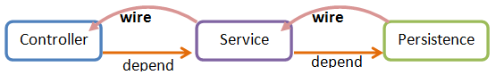

# DAO Implementation

The *Data Access Object (DAO)* pattern is a good practice to implement a
persistence layer and it encapsulates data access codes from the
business tier. A DAO object exposes an interface to a business object
and performs persistence operation relating to a particular persistent
entity. Now, we can implement persistence operations like CRUD in a DAO
class with JPA and `EntityManager` injected by Spring.

```java
@Repository
public class TodoDao {

    @PersistenceContext
    private EntityManager em;

    @Transactional(readOnly=true)
    public List<Todo> queryAll() {
        Query query = em.createQuery("SELECT t FROM Todo t");
        List<Todo> result = query.getResultList();
        return result;
    }

    ...

    @Transactional
    public Todo save(Todo todo){
        em.persist(todo);
        return todo;
    }

    @Transactional
    public Todo update(Todo todo){
        todo = em.merge(todo);
        return todo;
    }

    @Transactional
    public void delete(Todo todo){
        Todo r = get(todo.getId());
        if(r!=null){
            em.remove(r);
        }
    }
}
```

-   Line 1: We register `TodoDao` as a Spring bean with `@Repository`
    because it is a DAO class according to Spring's suggestion.
-   Line 4: As Spring manages our entity manager factory, it can
    understand `@PersistenceContext` and inject a transaction scope
    `EntityManager` for us. Hence, we don't need to create
    `EntityManager` by our own.
-   Line 7: We have enabled Spring's declarative transaction management
    so that we can apply `@Transactional` on a methods.

After completing DAO classes, we can inject them to our service class
with Spring's `@Autowired` because they are all Spring beans.

```java
@Service("todoListService")
@Scope(value="singleton",proxyMode=ScopedProxyMode.TARGET_CLASS)
public class TodoListServiceImpl implements TodoListService {

    @Autowired
    TodoDao dao;

    public List<Todo>getTodoList() {
        return dao.queryAll();
    }

    ...
}
```

Completing the above steps, we have created a dependency relationship
among the controller, service, and persistence classes as follows:



Each of these classes encapsulates cohesive functions and has decoupled
relationships with others. You can easily expand the architecture by
adding more classes or create dependencies between two layers.

You can visit <http://localhost:8080/essentials> to see the result.
