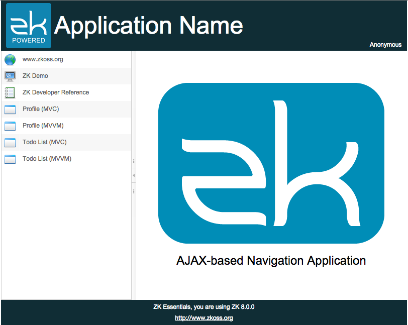

# Navigation and Template

In traditional navigation, a user usually switches to different
functions by visiting different pages of an application, a.k.a
page-based navigation. In ZK, we can have another choice to design the
navigation in AJAX-based, and users don't need to visit different
pages. In page-based navigation, users need to switch pages frequently,
we should maintain a consistent page design throughout whole application
to help users keep track of where they are. Luckily, since 8.0 ZK provides **Template Injection** to keep multiple pages in the same style easily.


In this chapter, the example application we are going to build looks as follows:



The sidebar is used for navigation control. There are 7 menu items on the sidebar, and the lower 4 items lead you to different functions. They only change the central area's content. All other areas are unchanged to maintain a consistent layout style during the navigation.


## Layout Template

In our example application, we want to keep a consistent layout for all functions. In this layout, the header, the sidebar, and
the footer keep unchanged regardless of which function a user chooses. Only the central area changes its content according to the function chosen by users.

In page-based navigation, each function is put into a separated page, and we need to keep a consistent layout style. One way is to copy the unchanged part from one zul to another, but it is hard to maintain. Fortunately, ZK provides a *Template Injection* that lets you define a zul as a template and apply (inject) it to multiple zul pages afterwards. All zul pages that apply the same template  have the same layout, so changing the template zul can change the layout of all pages once.

The steps to use a layout template are:

1. Create a zul as a template
2. Declare a template with a name in the target zul
3. Apply the template in the target zul with its name

Then when you visit the target zul page, ZK will insert the template to the position where you apply it upon template's name.

## 1. Create a Template ZUL

Creating a template zul is nothing different from creating a ordinary zul.

**chapter7/pagebased/layout/template.zul**

```xml
<zk>
	<borderlayout hflex="1" vflex="1">
		<north height="100px" border="none" >
			<include src="/chapter3/banner.zul"/>
		</north>
		<west width="260px" border="none" collapsible="true" splittable="true" minsize="300">
			<include src="/chapter7/pagebased/layout/sidebar.zul"/>
		</west>
		<center id="mainContent" autoscroll="true" border="none" >
			<apply template="center"/>
		</center>
		<south height="50px" border="none">
			<include src="/chapter3/footer.zul"/>
		</south>
	</borderlayout>
</zk>
```

-   Line 10: Apply another template which is a changed part.


## 2. Declare the Template

After creating a template zul, we shoulde decalre a template by `<template>` before applying it like:

```xml
<template name="layout" src="/chapter7/pagebased/layout/template.zul"/>
```

This tag will decalre a template named `layout` with its source zul path.

## 3. Apply the Template

Then we can apply the template with `<apply>`, which is a *shadow component* introduced in ZK 8, and specify a template's name like:

```xml
<apply template="layout"/>
```


