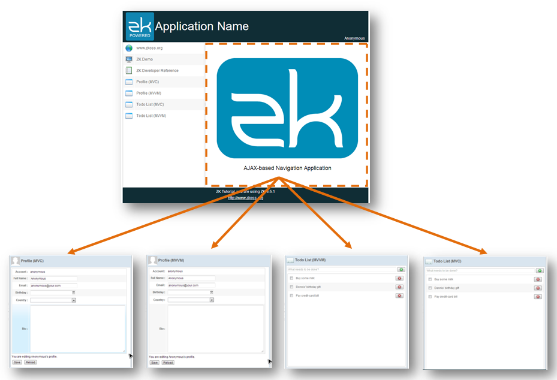

# AJAX-based Navigation - MVC approach

When switching between different functions in paged-based navigation,
you find that only central area's content is different among those pages
and other three areas (header, sidebar, and footer) contain identical
content. But in page-based navigation, a browser has to reload all
contents no matter they are identical to previous page when switching to
another function. With AJAX's help, ZK allows you to implement another
navigation way that only updates necessary part of a page instead of
reloading the whole page.


<div style="text-align:center">
<strong>AJAX-based Navigation</strong>
</div>

The easiest way to implement AJAX-based navigation is to change *Include* component's `src` attribute. It can change only partial content (inside the *Include*) of
an page instead of redirecting to another page to achieve the navigation
purpose. This navigation way switches functions by only replacing a
group of components instead of whole page and therefore has faster
response than page-based one. But it doesn't change a browser's URL when
each time switching to a different function. However, if you want users
can keep track of different functions with bookmark, please refer to [
Browser History Management](ZK_Developer's_Reference/UI_Patterns/Browser_History_Management).

We will demonstrate AJAX-based navigation with the same layout example.

Below is the index page, its content is nearly the same as the index
page of page based example except it replaces all `<include>` with `<apply>`.

**chapter6/ajaxbased/index.zul**
```xml
<?link rel="stylesheet" type="text/css" href="/style.css"?>
<zk>
	<borderlayout hflex="1" vflex="1" apply="org.zkoss.essentials.chapter6.ajaxbased.BookmarkChangeController">
		<north height="100px" border="none" >
			<apply templateURI="/chapter3/banner.zul"/>
		</north>
		<west width="260px" border="none" collapsible="true" splittable="true" minsize="300">
			<apply templateURI="/chapter6/ajaxbased/sidebar.zul"/>
		</west>
		<center id="mainContent" autoscroll="true" border="none">
			<apply templateURI="/chapter6/ajaxbased/mainContent.zul"/>
		</center>
		<south height="50px" border="none">
			<apply templateURI="/chapter3/footer.zul"/>
		</south>
	</borderlayout>
</zk>
```


**Replace `<include>` with `<apply>`**

As we don't need to dynamically change the path of those 3 areas (banner, side bar, footer), using `<apply>` is a better choice than `<include>`. Because `<apply>` create neither an extra `<div>` enclosin its content nor a id space. It's the main strength of using a shadow component that doesn't create a real component.


**chapter6/ajaxbased/mainContent.zul**
```xml
<zk>
	<include id="mainInclude"  src="/chapter6/ajaxbased/home.zul"/>
</zk>
```
- Line 2: We give the component id for we can find it later with ZK selector.

This navigation is mainly implemented by changing the `src` attribute of
the *Include* component to switch between different zul pages so that it
only reloads included components without affecting other areas . We
still need to initialize sidebar configuration:

**AJAX-based navigation's sidebar configuration**

``` java
public class SidebarPageConfigAjaxbasedImpl implements SidebarPageConfig{

    HashMap<String,SidebarPage> pageMap = new LinkedHashMap<String,SidebarPage>();
    public SidebarPageConfigAjaxbasedImpl(){
        pageMap.put("zk",new SidebarPage("zk","www.zkoss.org","/imgs/site.png","http://www.zkoss.org/"));
        pageMap.put("demo",new SidebarPage("demo","ZK Demo","/imgs/demo.png","http://www.zkoss.org/zkdemo"));
        pageMap.put("devref",new SidebarPage("devref","ZK Developer Reference","/imgs/doc.png","http://books.zkoss.org/wiki/ZK_Developer's_Reference"));

        pageMap.put("fn1",new SidebarPage("fn1","Profile (MVC)","/imgs/fn.png","/chapter3/profile-mvc.zul"));
        pageMap.put("fn2",new SidebarPage("fn2","Profile (MVVM)","/imgs/fn.png","/chapter3/profile-mvvm.zul"));
        pageMap.put("fn3",new SidebarPage("fn3","Todo List (MVC)","/imgs/fn.png","/chapter4/todolist-mvc.zul"));
        pageMap.put("fn4",new SidebarPage("fn4","Todo List (MVVM)","/imgs/fn.png","/chapter4/todolist-mvvm.zul"));
    }
    ...
}
```

-   Line 9 \~ 12: Because we only need those pages that doesn't have
    header, sidebar, and footer, we can re-use those pages written in
    previous chapters.

In the sidebar controller, we get the *Include* component and change its `src`
according to the menu item's URL.

**Controller for AJAX-based navigation**

```java
public class SidebarAjaxbasedController extends SelectorComposer<Component>{

    @Wire
    Grid sidebar;

    //wire service
    SidebarPageConfig pageConfig = new SidebarPageConfigAjaxbasedImpl();

    @Override
    public void doAfterCompose(Component comp) throws Exception{
        super.doAfterCompose(comp);

        //to initial view after view constructed.
        Rows rows = sidebar.getRows();

        for(SidebarPage page:pageConfig.getPages()){
            Row row = constructSidebarRow(page.getName(),page.getLabel(),page.getIconUri(),page.getUri());
            rows.appendChild(row);
        }
    }

    private Row constructSidebarRow(final String name,String label, String imageSrc, final String locationUri) {

        //construct component and hierarchy
        Row row = new Row();
        Image image = new Image(imageSrc);
        Label lab = new Label(label);

        row.appendChild(image);
        row.appendChild(lab);

        //set style attribute
        row.setSclass("sidebar-fn");

        //new and register listener for events
        EventListener<Event> onActionListener = new SerializableEventListener<Event>(){
            private static final long serialVersionUID = 1L;

            public void onEvent(Event event) throws Exception {
                //redirect current url to new location
                if(locationUri.startsWith("http")){
                    //open a new browser tab
                    Executions.getCurrent().sendRedirect(locationUri);
                }else{
                    //use iterable to find the first include only
                    Include include = (Include)Selectors.iterable(sidebar.getPage(), "#mainInclude")
                            .iterator().next();
                    include.setSrc(locationUri);

                    ...
                }
            }
        };
        row.addEventListener(Events.ON_CLICK, onActionListener);

        return row;
    }

}
```

-   Line 46,47: Since *Include* is not a child component of the
    component that `SidebarAjaxbasedController` applies to, we cannot
    use `@Wire` to retrieve it. Therefore, we use `Selectors.iterable()`
    to get components with the id selector from the page. Because ZK
    combines included components and its parent into one ZK page.
-   Line 48: Change the `src` to the corresponding URL that belongs to
    the clicked menu item.

Visit the
http://localhost:8080/zkessentials/chapter6/ajaxbased/index.zul to see
the result.


