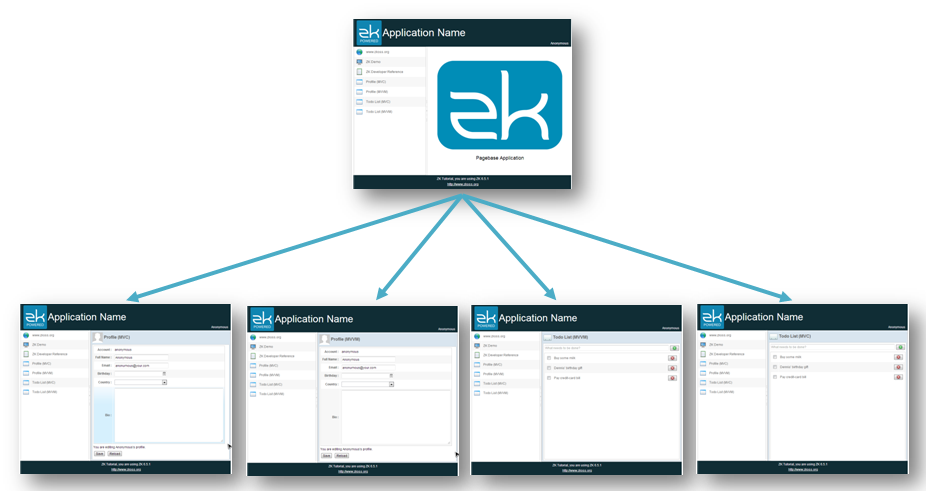
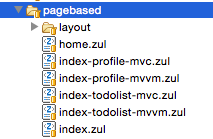

# Page-based Navigation

A traditional web application's navgation is usually designed as page-based. Each function corresponds to an independent page with independent URL. The navigation is very clear for users as they know where they are from the URL and they can press "go back" button on their browser to go back to previous pages in history. But the drawback is users have to wait whole page reloading every time they switch to a
function. Additionally, developers also have to maintain multiple pages
that have similar contents but applying a template zul can reduce this problem.



<div style="text-align:center">
<strong>Page-based Navigation</strong>
</div>

<br/>
To build a page-based navigation, first you should prepare corresponding pages for those items in the sidebar.

From below image, you can see there are 4 zul pages which correspond
to items in the sidebar under "chpater7\\pagebased" (index-profile-mvc.zul, index-profile-mvvm.zul, index-todolist-mvc.zul, index-todolist-mvvm.zul). Then we can link four items of the sidebar to these zul pages by redirecting a browser.



Next, we apply the template zul created before on those 4 pages. As you can see in previouse `template.zul`, in order to inject different content in the `<center>` area, we apply a template named `center` that is not declared in the `template.zul`. Therefore, We can decalre `center` template with different path to inject different content with the same layout.

**/chapter6/pagebased/index-profile-mvc.zul**

```xml
<?link rel="stylesheet" type="text/css" href="/style.css"?>
<zk>
<div height="100%">
	<template name="layout" src="/chapter6/pagebased/layout/template.zul"/>
	<apply template="layout"/>
	<template name="center" src="/chapter5/profile-mvc.zul"/>
</div>
</zk>
```

- Line 6: Apply the template named 'layout'.
- Line 7: Declare a tempalte injected in `layout` template.

Our example application creates those menu items dynamically upon a
configuration, so we should initialize configuration.

**Page-based navigation's sidebar configuration**

```java
public class SidebarPageConfigPagebasedImpl implements SidebarPageConfig{

    HashMap<String,SidebarPage> pageMap = new LinkedHashMap<String,SidebarPage>();
    public SidebarPageConfigPagebasedImpl(){
        pageMap.put("zk",new SidebarPage("zk","www.zkoss.org","/imgs/site.png","http://www.zkoss.org/"));
        pageMap.put("demo",new SidebarPage("demo","ZK Demo","/imgs/demo.png","http://www.zkoss.org/zkdemo"));
        pageMap.put("devref",new SidebarPage("devref","ZK Developer Reference","/imgs/doc.png"
                ,"http://books.zkoss.org/wiki/ZK_Developer's_Reference"));

        pageMap.put("fn1",new SidebarPage("fn1","Profile (MVC)","/imgs/fn.png"
                ,"/chapter6/pagebased/index-profile-mvc.zul"));
        pageMap.put("fn2",new SidebarPage("fn2","Profile (MVVM)","/imgs/fn.png"
                ,"/chapter6/pagebased/index-profile-mvvm.zul"));
        pageMap.put("fn3",new SidebarPage("fn3","Todo List (MVC)","/imgs/fn.png"
                ,"/chapter6/pagebased/index-todolist-mvc.zul"));
        pageMap.put("fn4",new SidebarPage("fn4","Todo List (MVVM)","/imgs/fn.png"
                ,"/chapter6/pagebased/index-todolist-mvvm.zul"));
    }

    ...

}
```
- Line 10\~17: Specify URL and related data for each menu item's configuration.

The following code shows how to redirect a user to an independent page
when users click a menu item in the sidebar.

**Controller for page-based navigation**

```java
public class SidebarPagebasedController extends SelectorComposer<Component>{

    ...

    //wire service
    SidebarPageConfig pageConfig = new SidebarPageConfigPagebasedImpl();

    @Override
    public void doAfterCompose(Component comp) throws Exception{
        super.doAfterCompose(comp);

        //to initial view after view constructed.
        Rows rows = fnList.getRows();

        for(SidebarPage page:pageConfig.getPages()){
            Row row = constructSidebarRow(page.getName(),page.getLabel(),page.getIconUri(),page.getUri());
            rows.appendChild(row);
        }
    }

    private Row constructSidebarRow(String name,String label, String imageSrc, final String locationUri) {

        //construct component and hierarchy
        Row row = new Row();
        Image image = new Image(imageSrc);
        Label lab = new Label(label);

        row.appendChild(image);
        row.appendChild(lab);

        //set style attribute
        row.setSclass("sidebar-fn");

        EventListener<Event> actionListener = new SerializableEventListener<Event>() {
            private static final long serialVersionUID = 1L;

            public void onEvent(Event event) throws Exception {
                //redirect current url to new location
                Executions.getCurrent().sendRedirect(locationUri);
            }
        };

        row.addEventListener(Events.ON_CLICK, actionListener);

        return row;
    }
}
```
- Line 15: Create menu items in the sidebar upon configurations with *Row*s.
- Line 39: Add an event listener to redirect a browser to the URL specified in the menu item a user clicks.

Visit <http://localhost:8080/essentials/chapter6/pagebased/index.zul>.
You will see the URL changes and whole page reloads each time you click
a different menu item.
