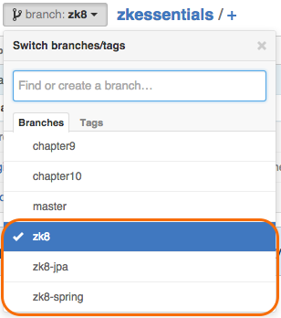
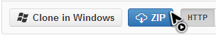
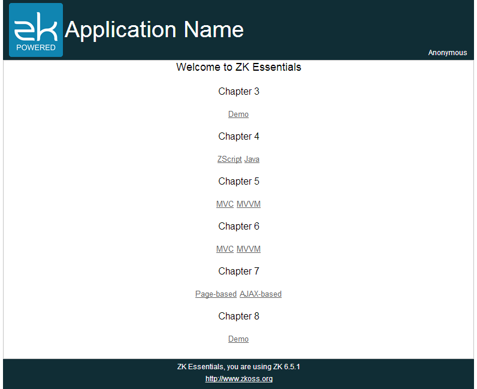

# Source Code

All source codes used in this book are available on
[github](https://github.com/zkoss/zkessentials). As our example
application has 3 different configurations, our source code is divided
into 3 branches:
[**zk8**](https://github.com/zkoss/zkessentials/tree/zk8),
[**chapter8-zk8**](https://github.com/zkoss/zkessentials/tree/chapter9-zk8), and
[**chapter9-zk8**](https://github.com/zkoss/zkessentials/tree/chapter10-zk8).

The **zk8** branch contains examples from chapter 1 to chapter 7. The
**chapter8-zk8** branch has examples integrated with Spring and the
**chapter9-zk8** branch contains examples which integrate with Spring and
use JPA to persist data into a database.

You can click the "ZIP" icon to download the current selected branch as
a zip file.

# Run Example Application

After you download the source code, you will find it is a Maven[^1]
project with jetty plugin configured. Therefore, if you have installed Maven, you
can run the example application with a simple command below[^2] (The maven we
use is **3.0.3**). Navigate to the root folder of your downloaded source
code, say it's "zkessentials" and type the command:

`mvn jetty:run`

Then visit the URL `http://localhost:8080/essentials/`, and you should
see the page below.

# Project Structure

The 2 images below show the project structure of the example
application. It's Maven default project structure, and all main source
codes are under `src/main`. The left image shows the Java source code is
under `src/main/java` and the right one shows the web application
content is under `src/main/webapp`.

<image src="images/ze-ch2-project-structure-java.png"/>
<image src="images/ze-ch2-project-structure-webapp.png"/>

<strong>Project Structure: Java(left) and Webapp(right)</strong>

We name the source code packages according to each chapter and each
package contains the classes used in the example of that chapter. Some
common classes are separated to an independent package as they are used
in multiple chapters. The classes under `org.zkoss.essentials.entity.*`
are entity class. We also define some business interfaces under
`org.zkoss.essentials.service.*` and different chapters have different
implementations.

For ZUL pages, we put them in an independent folder for each chapter
under `src/main/webapp/`. Under "WEB-INF" folder, **web.xml** contains
minimal configuration to run ZK and for its detail please refer to [ ZK
Installation Guide \\ Create and Run Your First ZK Application
Manually](http://books.zkoss.org/wiki/ZK%20Installation%20Guide/Quick%20Start/Create%20and%20Run%20Your%20First%20ZK%20Application%20Manually).
The "zk.xml" is optional configuration descriptor of ZK. Provide this
file if you need to configure ZK differently from the default behavior.
Refer to [ZK Configuration
Reference/zk.xml](http://books.zkoss.org/wiki/ZK%20Configuration%20Reference/zk.xml) for more
detail.

# References

[^1]: [Apache Maven](http://maven.apache.org/)

[^2]: [Start jetty in Maven](http://docs.codehaus.org/display/JETTY/Maven+Jetty+Plugin)
