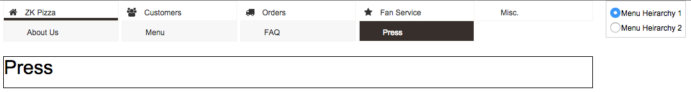

# Shadow Components

ZK 8 introduces a new set of components: **shadow component**. The shadow component which is like [shadow DOM](http://w3c.github.io/webcomponents/spec/shadow/) neither creates a corresponding component on the server side nor a widget on the client side. It just injects its child components inside into the current page. If we use them with data binding, a page can dynamically changes upon a ViewModel's data. Since shadow components have flow control and iteration function, if you identify a repeating view pattern appearing in your application. You can implement that view pattern with shadow components to modulize your view. Hence, its most powerful usage is **making the view reusable**.

These shadow components are:

* `<apply>`: allows you to choose which template to be applied. It will lookup the template inside-out recursively.
* `<forEach>`: allows you to iterate over a collection of objects. Specifying the collection by using the `items` attribute, and you can access the current item through a variable named specified at the `var` attribute.
* `<if>`: allows the conditional execution of its body according to the value of the test attribute.
* `<choose>`/`<when>`/`<otherwise>`: they are used for logic and flow control like Java's `switch`/`case`/`default` statement.


We can use shadow components on anywhere of a zul. For example, create a component upon a condition:
```xml
<if test="@load(vm.readonly)">
    <button label="Edit"/>
</if>
```

Or create a collection of components:
```xml
<forEach begin="0" end="3">
	<button label="${'Button'+=each}"/>
</forEach>
```

## Navigation Menu Example
In this chapter, we will demonstrate the power of shadow components with a navigation menu example below:


The menu is made by templates containing shadow components, and it can render different menu hierarchies without any change. You can switch 2 sets of menu hierarchy via the radio group on the right hand side. This example demonstrates how to reuse a common view pattern.

### Menu Data Structure
We store a menu hierarchical structure in a linked list, and each node in the list might have sub-menu.

```java
package org.zkoss.essentials.chapter5.template;

import java.util.*;
import org.zkoss.bind.annotation.*;
import org.zkoss.zk.ui.event.SelectEvent;
import org.zkoss.zkmax.zul.Navitem;

public class MenuViewModel {

    private List<MenuNode> menuHierarchy = null;
    ...
}
```


```java
package org.zkoss.essentials.chapter5.template;

import java.util.List;

public class MenuNode {

    private String label;
    private String iconSclass;
    private List<MenuNode> subMenus;
    ...
}
```


