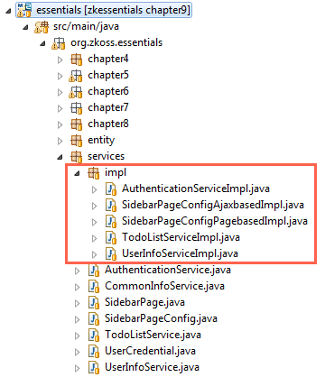

# Spring Integration

The Spring Framework is a popular application development framework for
enterprise Java. One key element is its infrastructural support: a
light-weighted IoC (Inversion of Control) container that manages POJOs
as Spring beans and their dependency relationship.

The most common integration way is to let Spring manage class
dependencies of an application. When a class "A" references a class "B"
and calls B's method, we say that A depends on B. In examples of
previous chapters, we create this dependency by instantiating B class in
A class as follows:

```java
public class ProfileViewController extends SelectorComposer<Component>{

    AuthenticationService authService = new AuthenticationServiceChapter8Impl();
    ...
}
```

-   `ProfileViewController` depends on `AuthenticationService`.

Spring can help us manage these dependencies without instantiating
dependent classes manually. In this chapter, we won't create new example
applications but will make previous examples integrate with Spring.


# Source Code

As we mentioned in the Introduction, our source code has [ 3
branches](../project_structure.md)
in github. The source code of this chapter's example belongs to the
branch: **chapter8**. You can select the "chapter8" branch and click
"zip" icon to download as a zip.

We don't create new examples in this chapter, but we re-organize some
classes. You can see from the image below. We move all service class
implementations to the package `org.zkoss.essentials.services.impl`.




# Configuration

## Maven

In order to integrate our ZK application with Spring, we must add
dependencies for Spring. The cglib is an optional dependency and we add
it because our application uses Spring's scoped-proxy that requires it.

**Extracted from pom.xml**

```xml
<properties>
    <zk.version>6.5.1</zk.version>
    <maven.build.timestamp.format>yyyy-MM-dd</maven.build.timestamp.format>
    <packname>-${project.version}-FL-${maven.build.timestamp}</packname>
    <spring.version>3.1.2.RELEASE</spring.version>
</properties>
...
    <!-- Spring 3 dependencies -->
    <dependency>
        <groupId>org.springframework</groupId>
        <artifactId>spring-web</artifactId>
        <version>${spring.version}</version>
    </dependency>
    <dependency>
        <groupId>cglib</groupId>
        <artifactId>cglib</artifactId>
        <version>2.2.2</version>
    </dependency>
```


## Deployment Descriptor

The deployment descriptor (web.xml) also needs two more listeners from
Spring.

**Extracted from web.xml**

```xml
<?xml version="1.0" encoding="UTF-8"?>

<web-app version="2.4" xmlns="http://java.sun.com/xml/ns/j2ee"
 xmlns:xsi="http://www.w3.org/2001/XMLSchema-instance"
 xsi:schemaLocation="http://java.sun.com/xml/ns/j2ee http://java.sun.com/xml/ns/j2ee/web-app_2_4.xsd">

    <description><![CDATA[ZK Essentials]]></description>
    <display-name>ZK Essentials</display-name>

    <!-- ZK configuration-->
    ...

    <!-- Spring configuration -->
    <!-- Initialize spring context -->
    <listener>
        <listener-class>
        org.springframework.web.context.ContextLoaderListener
        </listener-class>
    </listener>
    <!-- Enable webapp Scopes-->
     <listener>
        <listener-class>
        org.springframework.web.context.request.RequestContextListener
        </listener-class>
    </listener>

    <welcome-file-list>
        <welcome-file>index.zul</welcome-file>
    </welcome-file-list>
</web-app>
```

-   Line 16,17: The `ContextLoaderListener` reads Spring configuration,
    and default location is `WEB-INF/applicationContext.xml`.
-   Line 21,22: Use `RequestContextListener` to support web-scoped beans
    (`request`, `session`, `global session`).

Spring Configuration File
-------------------------

Create Spring configuration file with default name
(`applicationContext.xml`). We enable Spring's classpath scanning to
detect and register those class with annotation as beans automatically.

**WEB-INF/applicationContext.xml**

```xml
<beans xmlns="http://www.springframework.org/schema/beans"
    xmlns:context="http://www.springframework.org/schema/context"
    xmlns:xsi="http://www.w3.org/2001/XMLSchema-instance"
    xsi:schemaLocation="
        http://www.springframework.org/schema/beans
        http://www.springframework.org/schema/beans/spring-beans-3.0.xsd
        http://www.springframework.org/schema/context
        http://www.springframework.org/schema/context/spring-context-3.0.xsd">

    <context:component-scan base-package="org.zkoss.essentials" />

</beans>
```

-   Line 10: This configuration enables classpath scanning. Spring will
    automatically detect those classes with Spring bean annotations and
    register them in bean definitions. You should
    specify a common parent package or a comma-separated package list that
    includes all candidate classes at `base-package` attribute.


# Register Spring Beans

Starting from 2.0, Spring provides an option to detect beans by scanning
the classpath. Developers can use annotations (e.g. `@Component`) to
register bean definitions in the Spring container and this removes the
use of XML. We can use `@Component` which is a generic stereotype
annotation or those specialized stereotype annotation: `@Controller`,
`@Service`, or `@Repository` for presentation, service, persistence
layer, respectively. These annotations work equally for registering
beans but using specialized annotation makes your classes suited for
processing by tools.

When you register a bean, its bean scope is a "singleton" by default if
you don't specify it. Our service class is stateless so that it is
suitable to be a singleton-scoped bean. For those beans used in
composers, they should use scoped-proxy to ensure every time Spring will
retrieve them when a composer uses them. (Please use scoped-proxy even
for a singleton scoped bean, because scope of Spring beans doesn't match
scope of composers. Scoped-proxy can ensure composers get the latest
bean under their context. For furthermore explanation, please refer to [
Developer's Reference/Integration/Middleware
Layer/Spring](ZK_Developer%27s_Reference/Integration/Middleware_Layer/Spring "wikilink")
)

```java
@Service("authService")
@Scope(value="singleton",proxyMode=ScopedProxyMode.TARGET_CLASS)
public class AuthenticationServiceImpl implements AuthenticationService,Serializable{
...
}
```

-   Line 1: You could specify bean's name in `@Service` or its bean is
    derived from class name with first character in lower case (e.g.
    `authenticationServiceImpl` in this case).
-   Line 2: If you want to specify a bean's scope, use `@Scope`. For
    those beans used in composers, you should use scoped-proxy to ensure
    every time you get the latest bean.

Wire Spring Beans
=================

After registering beans for service classes, we can "wire" them in our
controllers with ZK's variable resolver. To wire a Spring bean in a
composer, we need to apply a
<javadoc>org.zkoss.zkplus.spring.DelegatingVariableResolver</javadoc>.
Then, we can apply annotation `@WireVariable` on a variable which we
want to wire a Spring bean with. ZK will then wire the corresponding
Spring bean with **the variable whose name is the same as the bean's
name**. Alternatively, you can specify the bean's name with
`@WireVariable("beanName")`.

You might think why don't we just register our controllers(or
ViewModels) as Spring beans, so that we can use Spring's `@Autowire`. We
don't recommend to do so. The main reason is that none of Spring bean's
scope matches ZK's composer's life cycle, for details please refer to [
Developer's
Reference](ZK_Developer%27s_Reference/Integration/Middleware_Layer/Spring "wikilink").

**Wire beans in a composer**

```java
@VariableResolver(org.zkoss.zkplus.spring.DelegatingVariableResolver.class)
public class SidebarChapter4Controller extends SelectorComposer<Component>{

    private static final long serialVersionUID = 1L;

    //wire components
    @Wire
    Grid fnList;

    //wire service
    @WireVariable("sidebarPageConfigPagebase")
    SidebarPageConfig pageConfig;

    ...
}
```

-   Line 11: Specify bean's name `sidebarPageConfigPagebase`

**Wire beans in a ViewModel**

```java
@VariableResolver(org.zkoss.zkplus.spring.DelegatingVariableResolver.class)
public class ProfileViewModel implements Serializable{
    private static final long serialVersionUID = 1L;

    //wire services
    @WireVariable
    AuthenticationService authService;
    @WireVariable
    UserInfoService userInfoService;
    ...
}
```

-   Line 6: Wire a Spring bean whose bean name is `authService`.

Wire Manually
-------------

When using `@WireVariable` out of a composer (or a ViewModel), ZK will
not wire Spring beans for you automatically. If you need to get a Spring
bean, you can wire them manually. The example below wires a Spring bean
in a page initiator:

```java
@VariableResolver(org.zkoss.zkplus.spring.DelegatingVariableResolver.class)
public class AuthenticationInit implements Initiator {

    @WireVariable
    AuthenticationService authService;

    public void doInit(Page page, Map<String, Object> args) throws Exception {
        //wire service manually by calling Selectors API
        Selectors.wireVariables(page, this, Selectors.newVariableResolvers(getClass(), null));

        UserCredential cre = authService.getUserCredential();
        if(cre==null || cre.isAnonymous()){
            Executions.sendRedirect("/chapter8/login.zul");
            return;
        }
    }
}
```

-   Line 9: After applying `@VariableResolver` and `@WireVariable`, use
    <javadoc>org.zkoss.zk.ui.select.Selectors</javadoc> to wire Spring
    beans manually.

After completing above steps, integration of Spring is done. The
application's appearance doesn't change, but its infrastructure is now
managed by Spring. You can visit <http://localhost:8080/essentials> to
see the result.

Source Code
===========

-   [ZUL
    pages](https://github.com/zkoss/zkessentials/tree/chapter9/src/main/webapp/)
-   [Java](https://github.com/zkoss/zkessentials/tree/chapter9/src/main/java/org/zkoss/essentials)

