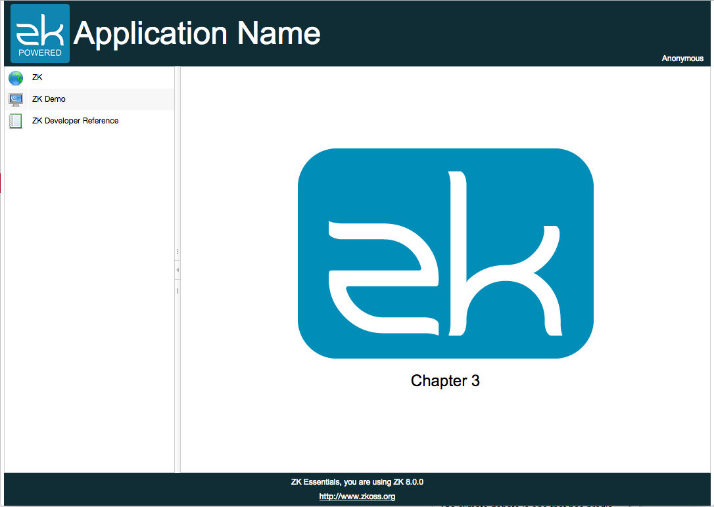
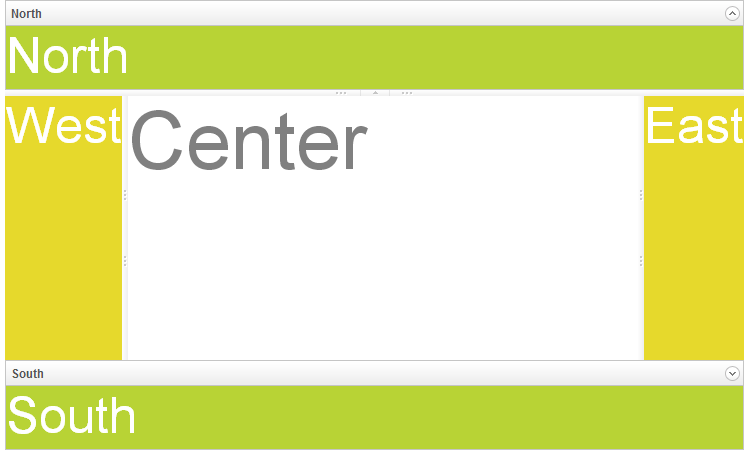

# Design the Layout
In the beginning, we will build the user interface which usually starts
from designing the layout. ZK provides various layout components for different
layout requirements, and you can even configure a component's attribute
to adjust layout details.

## Layout Requirement

The image above is the target layout we are going to create in this
chapter, and this kind of design is very common in web applications. The
banner at the top contains application icon, title, and user's name at
the right most corner. The footer at the bottom contains general
information. The sidebar on the left contains 3 links that direct you to
3 different URLs. The central area displays the current function.

ZK provides various layout components [^1], and each of them has
different styles. You can use a layout component alone or combine them
to build a more complex layout. According to our requirement, *Border
Layout*[^2] fits the requirement most since it has 5 areas: north, west,
center, east, and south. We can use the north as a banner, west as a
sidebar, south as a footer, and the center as the main function display.

<strong>Border Layout</strong>

[^1]: [ZK Demo Layout](http://www.zkoss.org/zkdemo/layout). ZK releases multiple editions. Some layout components are only available in a specific edition, please refer to [Feature & Edition](http://www.zkoss.org/whyzk/features)

[^2]: [Border Layout Demo](http://www.zkoss.org/zkdemo/layout/border_layout)

