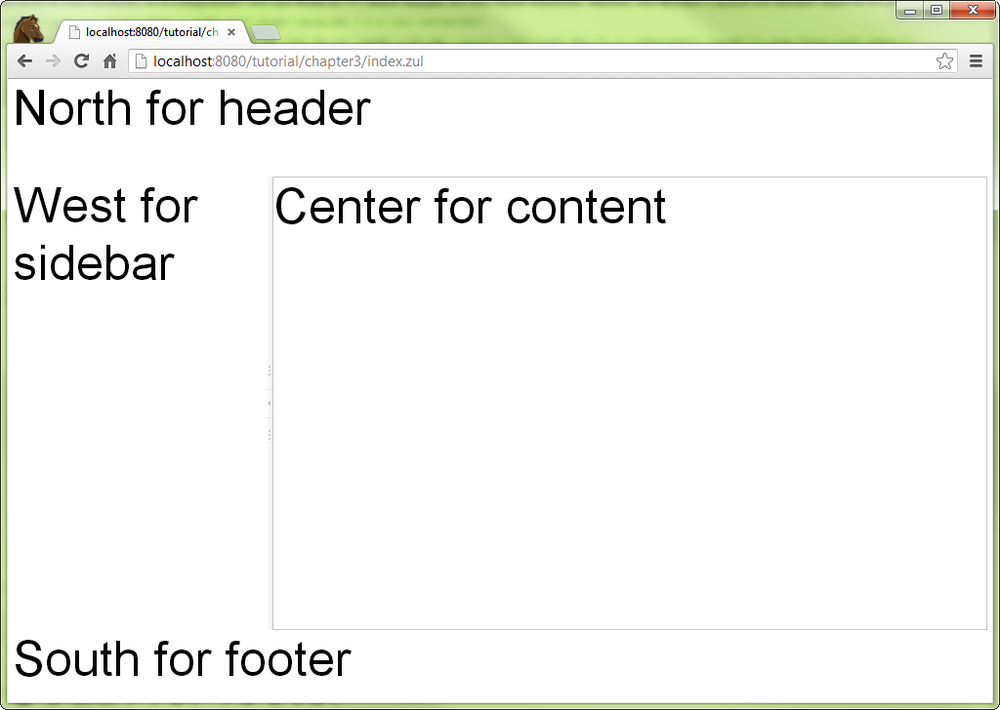

# Build the View
Building the View in ZK is basically creating components, and there are
two ways to do it: **Java** (programmatic) and **XML-based**
(declarative) approach. You can even mix these two approaches.

ZK allows you to compose a user interface in Java programmatically which
is a feature called [
richlet](http://books.zkoss.org/wiki/ZK%20Developer's%20Reference/UI%20Composing/Richlet),
but we don't use this approach in this book.

ZK also provides a XML-formatted language called **ZK User Interface
Markup Language (ZUML)**. Each XML element instructs ZK Loader to create a
component. Each XML attribute describes what value to be assigned to the
created component. We will use this approach mainly in our example.


## Write a ZUL
To create a component in ZK, we need to use a XML-based language named
**ZUL**, and all files written in ZUL should have the file extension
"**.zul**". In zul files, one component can be represented as an XML
element (tag), and you can configure each component's style, behavior,
and function by setting the element's attributes.[^1] First, create a
new text file with name *index.zul*, and type the following content:

**Extracted from chapter1/index.zul**

```xml
<zk>
    <borderlayout hflex="1" vflex="1">
        <north height="100px" border="none" >
            <label style="font-size:50px">North for header</label>
        </north>
        <west width="260px" border="none" collapsible="true"
              splittable="true" minsize="300">
            <label style="font-size:50px">West for sidebar</label>
        </west>
        <center id="mainContent" autoscroll="true">
            <label style="font-size:50px">Center for content</label>
        </center>
        <south height="50px" border="none">
            <label style="font-size:50px">South for footer</label>
        </south>
    </borderlayout>
</zk>
```

-   Line 2: Each XML tag represents one component, and the tag name is
    equal to the component name. The attribute [ "hflex" and
    "vflex"](http://books.zkoss.org/wiki/ZK%20Developer's%20Reference/UI%20Patterns/Hflex%20and%20Vflex)
    controls the horizontal and vertical size flexibility of a
    component. We set them to "1" which means *Fit-the-Rest*
    flexibility. Hence, the *Border Layout* will stretch itself to fill
    all available space of whole page in width and height because it is
    a root component. Only one component is allowed inside *North* in
    addition to a [
    *Caption*](http://books.zkoss.org/wiki/ZK%20Component%20Reference/Containers/Caption).
-   Line 3: *North* is a child component that can only be put inside a
    *Border Layout*. You can also fix a component's height by specifying
    a pixel value to avoid its height changing due to browser sizes.
-   Line 6, 7: Setting `collapsible` to true allows you to collapse the
    *West* area by clicking an arrow button. Setting `splittable` to
    true allows you to adjust the width of *West* and `minsize` limits
    the minimal size of width you can adjust.
-   Line 10: Setting `autoscroll` to true will decorate the *Center*
    with a scroll bar when *Center* contains lots of information that
    exceed the its height.
-   Line 4,8,11,14: These *Label*s are just for identifying
    *BorderLayout*'s areas and we will remove them in the final result.

Then, you can view the result from your browser as below:




# Construct User Interface with Components

Now we have a skeleton of the application, the next we need to do is to
fill each area with components. We will create a separate zul file for
each area and then combine them together.

**chapter1/main.zul**

```xml
            <vbox vflex="1" hflex="1" align="center"
                    pack="center" spacing="20px" >
                <image src="/imgs/zklogo2.png" />
                <label value="Chapter 3" sclass="head1"/>
            </vbox>
```

-   Line 1: The `spacing` controls the space between child components it
    contains.

In the banner, there's an image with a hyperlink, title, and user name.
Let's see how to construct these elements with existing ZK components:

**chapter1/banner.zul**

```xml
<div hflex="1" vflex="1" sclass="banner">
    <hbox hflex="1" vflex="1" align="center">
        <a href="http://www.zkoss.org/">
            <image src="/imgs/zklogo.png" width="90px" />
        </a>
        <div width="400px">
            <label value="Application Name" sclass="banner-head" />
        </div>
        <hbox hflex="1" vflex="1" pack="end" align="end">
            Anonymous
        </hbox>
    </hbox>
</div>
```

-   Line 1: The `sclass`, we can specify CSS class selector, and we will
    talk about it later.
-   Line 2: The [*Hbox*](http://books.zkoss.org/wiki/ZK%20Component%20Reference/Layouts/Hbox)
    which is a layout component can arrange its child components in a
    row horizontally. Its `align` attribute controls the vertical
    alignment.
-   Line 3: The [`A`](http://books.zkoss.org/wiki/ZK%20Component%20Reference/Essential%20Components/A)
    creates a hyperlink the same as an HTML `<a>` element.
-   Line 4: The [*image*](http://books.zkoss.org/wiki/ZK%20Component%20Reference/Essential%20Components/Image)
    is similar to HTML `` which can display an image.
-   Line 9: The `pack` controls the horizontal alignment. We specify
    `end` on both `pack` and `align` to make the text "Anonymous"
    display at the bottom right corner.
-   Line 10: Here we still don't implement authentication yet, so we use
    static user name "Anonymous" here.

For the sidebar, we want to arrange navigation items one by one
vertically. There are more than one way to achieve this. Here, we use a
[ *Grid*](http://books.zkoss.org/wiki/ZK%20Component%20Reference/Data/Grid) which is
suitable for arranging child components in a matrix layout.

**chapter1/sidebar.zul**

```xml
<grid hflex="1" vflex="1" sclass="sidebar">
    <columns>
        <column width="36px"/>
        <column/>
    </columns>
    <rows>
        <row>
            <image src="/imgs/site.png"/>
            <a href="http://www.zkoss.org/">ZK</a>
        </row>
        <row>
            <image src="/imgs/demo.png"/>
            <a href="http://www.zkoss.org/zkdemo">ZK Demo</a>
        </row>
        <row>
            <image src="/imgs/doc.png"/>
            <a href="http://books.zkoss.org/wiki/ZK_Developer's_Reference">
            ZK Developer Reference
            </a>
        </row>
    </rows>
</grid>
```

-   Line 1: Some components like *Grid* supports limited child
    components and you should also notice hierarchical relations between
    child components, e.g. *Rows* can only contain *Row*. Please refer
    to
    [ZK Component Reference/Data](http://books.zkoss.org/wiki/ZK%20Component%20Reference/Data)
    for detail.
-   Line 3: You can only put *Column* inside *Columns*.
-   Line 8,9: Since we define two *Column*s, each *Row* can have two
    components, and each one belongs to a column.

We usually put some contact information in the footer and make it
aligned to the center.

**chapter1/footer.zul**

```xml

<div hflex="1" vflex="1" sclass="footer">
    <vbox hflex="1" vflex="1" align="center">
        ZK Essentials, you are using ZK ${desktop.webApp.version}
        <a href="http://www.zkoss.org">http://www.zkoss.org</a>
    </vbox>
</div>
```

-   Line 2: The
    [*Vbox*](http://books.zkoss.org/wiki/ZK_Component_Reference/Layouts/Vbox), like
    *Hbox*, arranges child components vertically. We specify "center" at
    `align` to align those texts horizontally in the center.
-   Line 3: You can use [ EL
    expressions](ZUML_Reference/EL_Expressions "wikilink") in the tag
    element's body or an attribute. There are also many [ implicit
    objects](ZUML_Reference/EL_Expressions/Implicit_Objects "wikilink"),
    and `desktop` is one of them. Refer to
    <javadoc>org.zkoss.zk.ui.Desktop</javadoc>'s Javadoc to find out
    available properties.

Next, we will combine these separated zul pages into
`chapter1/index.zul`.


[^1]: [ZK Component Reference](http://books.zkoss.org/wiki/ZK_Component_Reference)
